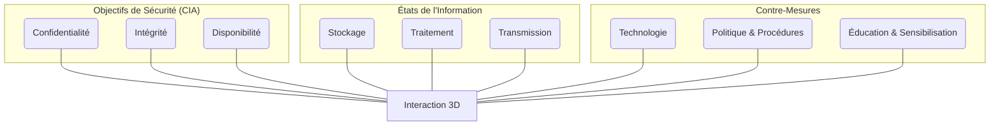

---
aliases:
  - Cube de McCumber
  - McCumber Cube
archetype: modele
cssclasses:
  - max
tags:
  - modele/mccumber-cube
  - securite-information/cadre-conceptuel
  - triade-cia
  - gestion-risques/contre-mesures
  - cycle-vie-donnees/etats-information
---

# Modèle : McCumber Cube

> [!abstract] Principe Fondamental
> Le Cube de McCumber est un modèle conceptuel tridimensionnel pour la sécurité des systèmes d'information, visant à structurer les efforts de sécurité autour de la protection de l'information à travers ses différents états de cycle de vie, en utilisant une combinaison d'objectifs et de contre-mesures. Il se présente comme une grille 3x3x3 comprenant 27 cellules uniques, chacune représentant une intersection spécifique des trois dimensions clés de la sécurité de l'information.

## 📐 Structure du Modèle
Le Cube de McCumber est représenté comme un cube avec trois axes, chacun divisé en trois catégories.

## 🧠 Concepts Clés

Le Cube de McCumber est un cadre à trois dimensions qui élargit le concept traditionnel de la Triade CIA (Confidentiality, Intégrité, Disponibilité) en y ajoutant les **états de l'information** et les **types de contre-mesures**. Cette [[HolisticApproach|approche intégrée]] vise à garantir que la sécurité est abordée de manière exhaustive, couvrant les aspects techniques, procéduraux et comportementaux.

Les trois dimensions sont :

1.  **Objectifs de Sécurité (Triade CIA)** : Représente ce qui doit être protégé.
    *   **Confidentialité** : Assurer que l'information n'est pas divulguée à des entités non autorisées (utilisateurs, processus, appareils). Elle protège les données sensibles contre l'accès non autorisé.
    *   **Intégrité** : Maintenir l'exactitude, l'exhaustivité et la pertinence des données, garantissant qu'une entité n'a pas été modifiée de manière non autorisée.
    *   **Disponibilité** : Garantir un accès opportun et fiable à l'information lorsque cela est nécessaire par une entité autorisée.

2.  **États de l'Information** : Décrit où les données se trouvent dans leur cycle de vie. Chaque état nécessite des mesures de sécurité spécifiques.
    *   **Stockage (At Rest)** : Informations conservées pour une utilisation future (bases de données, disques durs, environnements cloud).
    *   **Traitement (In Processing/In Use)** : Informations activement manipulées ou utilisées par des applications ou des utilisateurs (création, modification, calcul).
    *   **Transmission (In Transit)** : Informations transférées entre systèmes ou sur des réseaux.

3.  **Contre-Mesures (Mesures de Protection)** : Catégorise les méthodes utilisées pour protéger l'information.
    *   **Technologie (Contrôles Techniques)** : Outils matériels et logiciels tels que le chiffrement, les pare-feu, les antivirus et les systèmes de détection d'intrusion (IDS).
    *   **Politique et Procédures (Contrôles Administratifs)** : Règles administratives, directives opérationnelles, politiques de sécurité, formation des utilisateurs et conformité réglementaire.
    *   **Éducation, Formation et Sensibilisation (Facteurs Humains)** : Efforts axés sur l'humain pour développer les connaissances et la vigilance en matière de sécurité, y compris la sensibilisation aux menaces comme le phishing.

### Articulation des 27 Éléments
L'intersection de ces trois dimensions (3 objectifs x 3 états x 3 contre-mesures) crée 27 cellules uniques. Chacune de ces cellules représente un domaine spécifique de préoccupation en matière de sécurité qui doit être abordé de manière holistique.

*   **Exemple d'une cellule** : La cellule "Confidentialité - Transmission - Technologie" pourrait impliquer l'utilisation de protocoles de réseau sécurisés (comme un VPN) pour chiffrer les données en transit afin d'assurer leur confidentialité.
*   **Un autre exemple** : "Intégrité - Stockage - Politique et Procédures" pourrait impliquer l'établissement de politiques de gestion des accès et de contrôle des versions pour s'assurer que les données stockées ne sont pas modifiées de manière non autorisée.
*   **Un troisième exemple** : "Disponibilité - Traitement - Éducation et Sensibilisation" pourrait concerner des procédures de réponse aux incidents pour traiter les attaques par déni de service et la formation des utilisateurs sur la manière de signaler les activités suspectes qui pourraient affecter la disponibilité des systèmes.

En considérant toutes les 27 combinaisons, les organisations peuvent identifier les vulnérabilités potentielles et élaborer une stratégie de sécurité complète et résiliente.

## ✅ Avantages vs Inconvénients
| Avantages | Inconvénients |
|---|---|
| Fournit un cadre **holistique** et **complet** pour la sécurité de l'information. | Peut être perçu comme **complexe** en raison de ses 27 cellules, nécessitant une analyse détaillée. |
| Permet d'identifier les vulnérabilités en analysant comment les données sont protégées à travers différents états et avec diverses mesures. | Ne spécifie pas les **priorités** ou la **gravité** des risques associés à chaque cellule. |
| Aide à développer des stratégies de sécurité **équilibrées** qui ne dépendent pas excessivement d'un seul type de contre-mesure. | L'application peut être **longue** et **demander des ressources** importantes pour couvrir toutes les combinaisons. |
| S'adapte aux évolutions technologiques en se concentrant sur les concepts plutôt que sur des technologies spécifiques. | La représentation visuelle 3D peut être difficile à rendre complètement en 2D pour une planification ou une documentation. |
| Facilite la gestion des risques, le développement de politiques et la conception de formations. | Moins détaillé sur les interactions dynamiques et les dépendances complexes entre les éléments en temps réel. |

## 🔗 Notes Connexes
*   **Modèle fondamental** : Triade CIA
*   **Frameworks d'application** : NIST, ISO 27001, CIS Controls
---