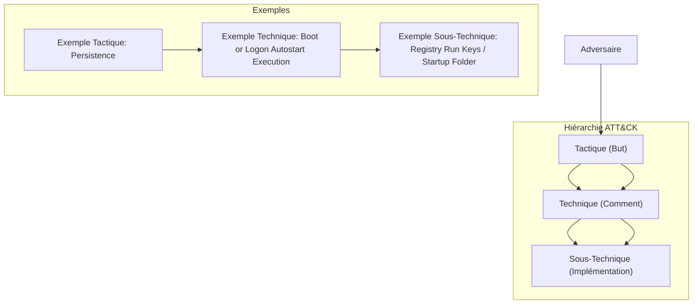

---
aliases:
  - Modèle MITRE ATT&CK Framework
  - Référentiel MITRE ATT&CK
  - MITRE ATT&CK Framework
  - Adversarial Tactics, Techniques, and Common Knowledge
  - MITRE ATT&CK
  - ATT&CK
archetype: modele
cssclasses:
  - max
tags:
  - mitre-att-ck
  - framework
  - modele
  - acteur-de-menace
  - analyse/threat-hunting
  - red-teaming
  - emulation-adversaire
  - defense
  - reponse-incident
  - mitre-att-ck/tactique
  - mitre-att-ck/technique
  - mitre-att-ck/sous-technique
---

# Modèle : MITRE ATT&CK Framework

> [!abstract] Principe Fondamental
> Le framework MITRE ATT&CK est une base de connaissances mondiale des tactiques et techniques adverses basées sur des observations réelles, utilisée comme fondement pour le développement de modèles et de méthodologies de sécurité spécifiques.

## 📐 Structure du Modèle

## 🧠 Concepts Clés
*   **Tactiques** : Elles représentent les objectifs techniques de haut niveau d'un attaquant (le "pourquoi" une attaque est menée). Ces tactiques sont les intentions derrière une action, comme l'accès initial, la persistance ou l'exfiltration de données.
*   **Techniques** : Décrivent les méthodes spécifiques par lesquelles les adversaires atteignent ces objectifs tactiques (le "comment" ils les réalisent). Chaque technique peut être mise en œuvre de diverses manières.
*   **Sous-Techniques** : Fournissent une description plus granulaire des techniques, détaillant des méthodes plus spécifiques utilisées par les adversaires pour exécuter une technique donnée. Elles illustrent les différentes approches ou outils qu'un attaquant pourrait employer.
*   **Matrices** : Le framework ATT&CK est présenté sous forme de matrices qui organisent les tactiques et les techniques par environnement opérationnel (ex: Enterprise, Mobile, ICS). Chaque matrice permet une visualisation claire des différents stades d'une attaque potentielle.
    *   **Enterprise ATT&CK** : Couvre les environnements Windows, macOS, Linux, Cloud (AWS, GCP, Azure, Azure AD, Office 365, SaaS), Network et Containers.
    *   **Mobile ATT&CK** : Se concentre sur les plateformes iOS et Android.
    *   **ICS ATT&CK** : Vise les systèmes de contrôle industriels.

## ✅ Avantages vs Inconvénients
| Avantages | Inconvénients |
|---|---|
| **Langage Commun** : Fournit un vocabulaire standardisé pour discuter des menaces, des défenses et des capacités adverses. | **Complexité Initiale** : La richesse et la granularité peuvent être intimidantes pour les nouveaux utilisateurs, nécessitant un temps d'apprentissage. |
| **Amélioration de la Défense** : Aide les équipes de sécurité à identifier les lacunes dans leurs défenses, à prioriser les investissements et à évaluer l'efficacité des contrôles de sécurité existants. | **Maintien et Évolution** : Le framework est constamment mis à jour, ce qui peut rendre difficile le maintien d'une référence à jour dans les systèmes internes. |
| **Chasse aux Menaces (Threat Hunting)** : Permet aux chasseurs de menaces de rechercher activement des activités adverses spécifiques au sein de leurs environnements. | **Manque de Contextualisation** : Bien que détaillé, le framework ne fournit pas toujours le contexte complet de *pourquoi* ou *quand* une technique est utilisée dans une chaîne d'attaque réelle, nécessitant une analyse supplémentaire. |
| **Red Teaming et Émulation** : Sert de base pour simuler des attaques réalistes et tester la résilience des systèmes et des équipes de réponse. | **Pas une Solution Complète** : ATT&CK est un référentiel, pas une solution de sécurité autonome; son efficacité dépend de la manière dont il est intégré et utilisé par une organisation. |
| **Analyse des Incidents** : Facilite la compréhension des techniques utilisées lors d'un incident, aidant à la remédiation et à la prévention des attaques futures. | |