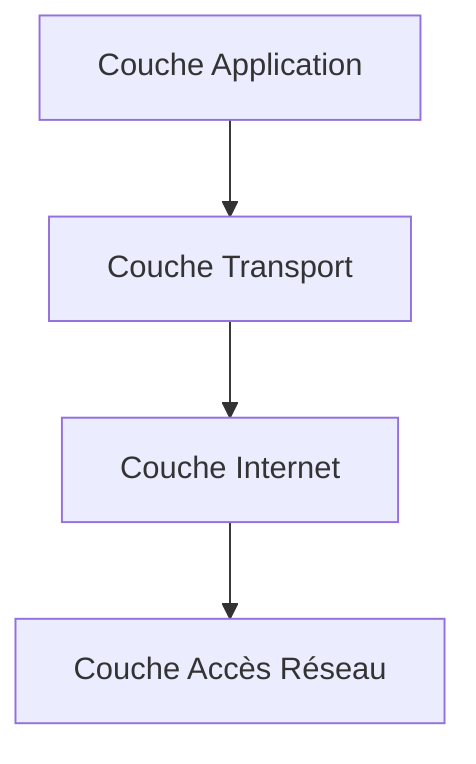

---
aliases:
  - Couche Accès Réseau
  - Network Access Layer
  - Couche Hôte-Réseau
  - Host-to-Network Layer
  - couche Accès Réseau TCP/IP
archetype: modele
cssclasses:
  - max
tags:
  - modele
  - modele-tcp-ip
  - modele-tcp-ip/couche-acces-reseau
  - modele-osi
  - modele-osi/couche-1
  - modele-osi/couche-2
  - ethernet
  - wifi
  - protocole/ppp
  - protocole/arp
  - protocole/fddi
  - protocole/token-ring
  - transmission-donnees
  - reseau/physique
  - reseau/adressage/mac
  - controle-erreur
  - encapsulation
  - reseau/trame
  - gestion-acces
---

# Modèle : Network Access Layer (TCP/IP Model)

> [!abstract] Principe Fondamental
> La couche Accès Réseau du modèle TCP/IP est responsable de la transmission et de la réception des données à travers le média physique du réseau, englobant les fonctionnalités des couches physique et liaison de données du modèle OSI.

## 📐 Structure du Modèle

## 🧠 Concepts Clés
*   **Définition et Rôle Principal** : La couche Accès Réseau (également appelée Couche Liaison ou Couche Hôte-Réseau) est la couche la plus basse du modèle TCP/IP. Ses fonctions principales incluent la gestion de la connexion physique entre les dispositifs, la préparation des données pour la transmission sur le support physique, et le contrôle de l'accès à ce support. Elle encapsule les paquets de la couche Internet dans des trames adaptées au réseau physique et assure la détection d'erreurs au niveau de la trame.
*   **Protocoles et Technologies Associés** : Cette couche prend en charge divers protocoles et technologies qui permettent la communication sur des réseaux physiques spécifiques. Parmi les exemples les plus courants, on trouve :
    *   **Ethernet** : Utilisé pour les réseaux locaux câblés, il gère la transmission physique des données et le contrôle d'accès au support.
    *   **Wi-Fi (IEEE 802.11)** : Pour les réseaux locaux sans fil, il définit les normes pour la communication radio.
    *   **PPP (Point-to-Point Protocol)** : Utilisé pour établir des connexions directes entre deux nœuds, souvent sur des liaisons WAN.
    *   **ARP (Address Resolution Protocol)** : Permet de mapper une adresse IP logique à une adresse physique (MAC) sur un réseau local.
    *   **FDDI (Fiber Distributed Data Interface)** et **Token Ring** : Technologies de réseau local plus anciennes.
*   **Relation avec le Modèle OSI** : La couche Accès Réseau du modèle TCP/IP est unique car elle combine les fonctionnalités de deux couches distinctes du modèle OSI (Open Systems Interconnection) : la couche Physique (Couche 1) et la couche Liaison de Données (Couche 2).
    *   ***Couche Physique (OSI - Couche 1)*** : Cette couche est responsable de la transmission des bits bruts sur le support physique (câbles, fibre optique, ondes radio). Elle définit les caractéristiques électriques, mécaniques, fonctionnelles et procédurales de l'interface physique et du support de transmission. Cela inclut les spécifications des connecteurs, les niveaux de tension et le synchronisation des bits.
    *   ***Couche Liaison de Données (OSI - Couche 2)*** : Cette couche assure le transfert de données entre nœuds directement connectés. Elle gère l'encapsulation des données en trames, le contrôle d'accès au média (MAC), l'adressage physique (adresses MAC) et la détection d'erreurs au sein de la trame pour garantir la fiabilité de la transmission sur une liaison spécifique. Elle est souvent subdivisée en sous-couches LLC (Logical Link Control) et MAC (Media Access Control).

    En regroupant ces deux couches, le modèle TCP/IP offre une approche plus pragmatique, axée sur l'implémentation, tout en déléguant la gestion des erreurs de bout en bout et l'ordonnancement des paquets à des couches supérieures comme la couche Transport (avec TCP).

## ✅ Avantages vs Inconvénients
| Avantages | Inconvénients |
|---|---|
| **Flexibilité** : Indépendante de la technologie réseau sous-jacente, elle peut s'adapter à une grande variété de supports physiques (Ethernet, Wi-Fi, etc.). | **Moins de Granularité** : Regrouper les couches physique et liaison de données peut masquer certains détails de bas niveau, rendant le diagnostic de problèmes spécifiques plus complexe dans certains scénarios par rapport au modèle OSI. |
| **Adaptabilité** : Facilite l'intégration de nouvelles technologies de réseau sans affecter les couches supérieures du modèle TCP/IP. | **Dépendance des couches supérieures pour la fiabilité** : Les fonctions avancées de contrôle d'erreurs et de flux sont souvent laissées aux couches Transport (TCP) ou Application, ce qui peut ne pas être optimal pour toutes les applications ou tous les types de réseaux. |
| **Simplicité du Modèle** : Le modèle à quatre couches est plus simple et plus facile à comprendre et à implémenter que le modèle OSI à sept couches. | |
| **Encourage la concurrence** : Permet aux produits de différents fournisseurs de fonctionner ensemble, favorisant l'innovation. | |
## 🔗 Notes Connexes
* [[DataLinkLayer|OSI Layer 2]]
* [[PhysicalLayer|OSI Layer 1]]
