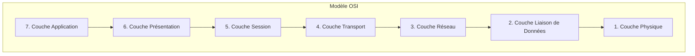

---
aliases:
  - Couche Réseau
  - Couche 3 OSI
  - Network Layer
  - OSI Layer 3
  - Internet Layer
  - Couche 3
archetype: modele
cssclasses:
  - max
tags:
  - modele-osi
  - modele-osi/couche-3
  - reseau/adressage/ip
  - protocole/ip
  - protocole/ip/ipv4
  - protocole/ip/ipv6
  - routage-reseau
  - routage/dynamique
  - routeur
  - protocole/rip
  - protocole/ospf
  - protocole/bgp
  - protocole/eigrp
  - mecanisme/encapsulation
  - protocole/ip/header
  - interconnexion-reseau
  - protocole/icmp
  - protocole/igmp
  - protocole/arp
  - materiel/reseau/switch
  - reseau/paquet
---

# Modèle : Couche Réseau (Couche 3 du modèle OSI)

> [!abstract] Principe Fondamental
> La Couche Réseau, troisième couche du modèle OSI, est responsable de l'interconnexion des réseaux hétérogènes en déterminant les chemins optimaux pour les paquets de données et en gérant l'adressage logique de bout en bout.

## 📐 Structure du Modèle

## 🧠 Concepts Clés
*   **Adressage Logique (Adresses IP)** : La Couche Réseau attribue une **adresse IP** unique et logique à chaque appareil connecté au réseau. Ces adresses (IPv4, IPv6) sont hiérarchiques et distinctes des adresses MAC physiques de la couche Liaison de Données, permettant l'identification des appareils à travers différents réseaux. Une adresse IP se compose d'une partie réseau et d'une partie hôte.
*   **Routage** : C'est la fonction principale de la couche 3. Le routage consiste à déterminer le **chemin optimal** (la "route") que les paquets de données doivent emprunter pour atteindre leur destination à travers un ou plusieurs réseaux interconnectés. Les **routeurs** sont les dispositifs clés qui opèrent à cette couche, utilisant des tables de routage et des protocoles de routage (comme RIP, OSPF, BGP) pour prendre ces décisions d'acheminement.
*   **Encapsulation et Fragmentation des Paquets** : La Couche Réseau reçoit des segments de données de la couche Transport et les encapsule dans des unités appelées **paquets** (ou datagrammes IP), en ajoutant un en-tête IP contenant les adresses source et destination. Elle peut également fragmenter les paquets trop volumineux pour un support réseau donné et les réassembler à la réception.
*   **Interconnexion des Réseaux (Internetworking)** : Cette couche rend possible la communication entre des réseaux hétérogènes, créant des chemins logiques à travers de multiples segments de réseau pour une connectivité globale.
*   **Protocoles Clés** :
    *   **IP (Internet Protocol)** : Le protocole fondamental pour l'adressage logique et le routage des paquets (versions IPv4 et IPv6).
    *   **[[ICMPProtocol|ICMP]] (Internet Control Message Protocol)** : Utilisé pour les messages de diagnostic et de rapport d'erreurs (par exemple, la commande `ping`).
    *   **IGMP (Internet Group Management Protocol)** : Gère l'appartenance aux groupes de multidiffusion IP.
    *   **ARP (Address Resolution Protocol)** : Bien qu'il opère conceptuellement entre la couche 2 et 3, il est crucial pour mapper les adresses IP logiques aux adresses MAC physiques.
    *   **Protocoles de Routage** : RIP (Routing Information Protocol), OSPF (Open Shortest Path First), BGP ([[BGPProtocol|Border Gateway Protocol]]), EIGRP (Enhanced Interior Gateway Routing Protocol).
*   **Équipements** : Les principaux équipements fonctionnant à cette couche sont les **routeurs** et les **commutateurs de couche 3**.

## ✅ Avantages vs Inconvénients
| Avantages | Inconvénients |
|---|---|
| **Normalisation et Interopérabilité** : Facilite la communication entre les équipements de différents fabricants grâce à des normes claires. | **Complexité Élevée** : Le modèle OSI est souvent jugé plus complexe que des modèles plus pragmatiques comme TCP/IP, avec de nombreuses couches. |
| **Modularité** : Permet aux développeurs de se concentrer sur l'amélioration d'une couche sans affecter les autres, favorisant l'innovation. | **Duplication de Services** : Certaines fonctions (comme le contrôle de flux et la gestion des erreurs) peuvent être implémentées dans plusieurs couches, entraînant des redondances. |
| **Facilite le Dépannage** : Permet d'isoler rapidement les problèmes réseau à une couche spécifique, simplifiant le diagnostic. | **Modèle Théorique** : Plus un modèle de référence conceptuel qu'une implémentation directe, ce qui peut rendre son application pratique moins évidente que TCP/IP. |
| **Support Flexible** : Prend en charge les services orientés connexion et sans connexion. | **Couches Peu Utilisées** : Les couches Session et Présentation ont des fonctionnalités parfois limitées ou fusionnées avec d'autres couches dans les implémentations réelles. |
## 🔗 Notes Connexes
- [[InternetLayerTCPIP|Couche Internet TCP/IP]]