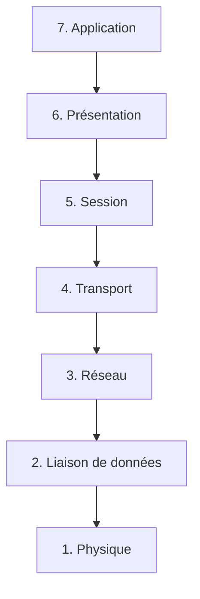

---
aliases:
  - Modèle OSI
  - OSI Model
  - Open Systems Interconnection Model
  - OSI
archetype: modele
cssclasses:
  - max
tags:
  - modele/osi
  - reseau
  - reseau/communication
  - protocole
  - modele-osi/couche-1
  - modele-osi/couche-2
  - modele-osi/couche-3
  - modele-osi/couche-4
  - modele-osi/couche-5
  - modele-osi/couche-6
  - modele-osi/couche-7
  - modele/tcp-ip
---

# Modèle : OSI

> [!abstract] Principe Fondamental
> Le modèle OSI (Open Systems Interconnection) est un cadre conceptuel qui décrit et standardise les fonctions de communication d'un système de télécommunication ou de calcul, en les décomposant en sept couches distinctes.

## 📐 Structure du Modèle

## 🧠 Concepts Clés
Le modèle OSI est composé de sept couches, chacune ayant des fonctions spécifiques et communiquant avec la couche adjacente via des interfaces.

*   **Couche 1 : Physique (Physical Layer)** : Cette couche s'occupe de la transmission physique des bits bruts sur un support de communication. Elle définit les spécifications électriques, mécaniques, fonctionnelles et procédurales pour l'activation, le maintien et la désactivation des liaisons physiques. Des exemples incluent les câbles Ethernet, les connecteurs USB et les signaux radio.
*   **Couche 2 : Liaison de données (Data Link Layer)** : La couche de liaison de données assure la transmission de données fiables entre deux nœuds directement connectés. Elle gère le contrôle d'accès au support (MAC), la détection et la correction des erreurs physiques, et l'adressage physique (adresses MAC).
*   **Couche 3 : Réseau (Network Layer)** : La couche réseau est responsable du routage des paquets à travers différentes machines et réseaux. Elle gère l'adressage logique (adresses IP) et la sélection du meilleur chemin pour acheminer les données du point de départ au point d'arrivée.
*   **Couche 4 : Transport (Transport Layer)** : Cette couche assure la transmission de données de bout en bout entre les applications. Elle est responsable de la segmentation des données en paquets, de la retransmission des paquets perdus et du contrôle de flux. Le TCP (Transmission Control Protocol) et l'UDP (User Datagram Protocol) sont des exemples de protocoles de cette couche.
*   **Couche 5 : Session (Session Layer)** : La couche session établit, gère et termine les sessions de communication entre les applications. Elle synchronise la communication et gère les dialogues, permettant par exemple à deux applications de savoir où reprendre une transmission en cas d'interruption.
*   **Couche 6 : Présentation (Presentation Layer)** : Cette couche est chargée de la traduction, du chiffrement et de la compression des données afin d'assurer que les données sont présentées dans un format utilisable par la couche application. Elle gère la syntaxe et la sémantique de l'information.
*   **Couche 7 : Application (Application Layer)** : La couche application est la plus proche de l'utilisateur final et fournit des services réseau aux applications logicielles. Elle contient des protocoles qui permettent aux utilisateurs d'interagir avec le réseau, tels que HTTP, FTP, SMTP et DNS.

## ✅ Avantages vs Inconvénients
| Avantages | Inconvénients |
|---|---|
| Facilite la compréhension des interactions réseau complexes. | Trop théorique, difficile à appliquer directement pour des implémentations réelles. |
| Permet l'interopérabilité entre les équipements de différents fournisseurs. | Certaines couches sont peu utilisées ou fusionnées dans des modèles plus pratiques (ex: TCP/IP). |
| Aide à la résolution des problèmes en isolant les pannes par couche. | Ne prend pas en compte les interactions entre les protocoles de couches non adjacentes. |
| Favorise le développement de technologies standardisées. | Introduction tardive par rapport à TCP/IP, moins adopté en pratique. |

## 🔗 Notes Connexes
*   **Application** : *TCP/IP* (modèle de référence souvent comparé)
*   **Modèle concurrent** : *Modèle TCP/IP*