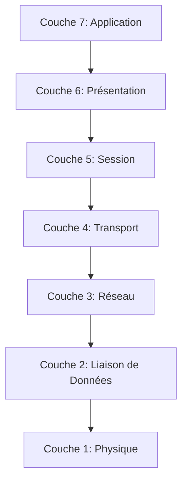

---
aliases:
  - Couche de Session
  - Session Layer
  - Layer 5
  - OSI Layer 5
  - OSI Session Layer
  - Couche 5
archetype: modele
cssclasses:
  - max
tags:
  - modele
  - modele-osi
  - modele-osi/couche-5
  - gestion-session
  - synchronisation
  - communication/controle-dialogue
  - communication/full-duplex
  - communication/half-duplex
  - modele/tcp-ip
  - modele/tcp-ip/couche-application
  - reseau
  - application
---

# Modèle : Couche de Session (Modèle OSI)

> [!abstract] Principe Fondamental
> La Couche de Session (Couche 5) du modèle OSI est responsable de l'établissement, de la gestion et de la terminaison des sessions de communication entre les applications sur différents hôtes, assurant un dialogue structuré et synchronisé.

## 📐 Structure du Modèle

## 🧠 Concepts Clés
*   **Contrôle du Dialogue (Dialogue Control)** : La couche de session détermine qui peut transmettre des données et quand, établissant des modes de communication tels que le duplex intégral (full-duplex) où les deux parties peuvent envoyer et recevoir simultanément, ou le semi-duplex (half-duplex) où les parties alternent les transmissions. Elle gère les jetons pour s'assurer qu'une seule partie parle à la fois en mode semi-duplex.
*   **Synchronisation (Synchronization)** : Ce mécanisme insère des points de synchronisation (également appelés *points de contrôle* ou *checkpoints*) dans le flux de données. En cas de défaillance ou d'interruption, la communication peut reprendre à partir du dernier point de synchronisation validé plutôt que de redémarrer depuis le début. Cela est particulièrement utile pour le transfert de fichiers volumineux.
*   **Gestion de Session (Session Management)** : La couche de session est chargée de la mise en place, du maintien et de la terminaison des sessions entre les applications. Elle fournit les services pour organiser et synchroniser le dialogue entre des applications communicantes.
*   **Interaction avec les Couches Adjacentes** :
    *   **Avec la Couche de Présentation (Couche 6)** : La couche de session reçoit des données formatées de la couche de présentation et lui fournit des services pour gérer le dialogue. La couche de présentation est responsable de la syntaxe et de la sémantique de l'information, tandis que la couche de session assure que cette information est échangée de manière ordonnée.
    *   **Avec la Couche de Transport (Couche 4)** : La couche de session utilise les services de communication fiables ou non fiables fournis par la couche de transport (par exemple, TCP ou UDP) pour échanger des données. La couche de transport est chargée de la livraison de bout en bout des segments, tandis que la couche de session ajoute une structure au dialogue au-dessus de cette livraison de données.

*   **Correspondances avec le Modèle TCP/IP** : Le modèle TCP/IP ne possède pas de couche de session distincte. Les fonctionnalités de la couche de session du modèle OSI sont généralement intégrées dans la *couche Application* du modèle TCP/IP (qui combine les couches Application, Présentation et Session de l'OSI). Des protocoles au niveau application comme HTTP, FTP ou SMTP gèrent souvent leurs propres mécanismes de session, de synchronisation et de contrôle du dialogue.

## ✅ Avantages vs Inconvénients
| Avantages | Inconvénients |
|---|---|
| Fournit une **structure claire** pour la gestion du dialogue inter-applications. | Complexité ajoutée au modèle, souvent redondante avec les fonctionnalités de la couche application TCP/IP. |
| Permet la **reprise des sessions** via des points de synchronisation, améliorant la résilience. | Peu implémentée comme une couche distincte dans les protocoles Internet modernes. |
| Gère les **modes de communication** (full/half-duplex) au niveau applicatif. | Peut entraîner un surdébit (overhead) si les applications ne nécessitent pas une gestion de session explicite. |
| Facilite la **conception modulaire** des réseaux en séparant les responsabilités. | La fusion des couches supérieures de l'OSI dans la couche application de TCP/IP montre une approche plus pragmatique pour le web. |
## 🔗 Notes Connexes
* [[TcpIpApplicationLayer|TCP/IP Application Layer]]