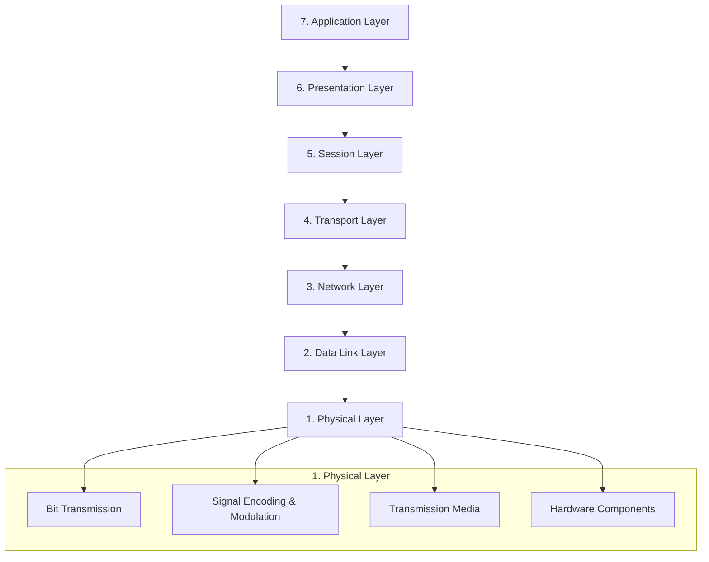

---
aliases:
  - Couche Physique
  - Physical Layer
  - OSI Layer 1
  - Layer 1
  - Couche 1
cssclasses:
  - max
archetype: modele
tags:
  - modele/osi
  - modele/osi/couche-1
  - reseau
  - communication
  - transmission-donnees
  - encoding
  - synchronisation
  - materiel
  - materiel/cable
  - reseau/sans-fil
  - reseau/topologie
  - communication/half-duplex
  - communication/full-duplex
  - bit
---

# Modèle : Physical Layer (Couche 1 du Modèle OSI)

> [!abstract] Principe Fondamental
> La couche Physique est la première et la plus basse couche du modèle OSI, responsable de la transmission et de la réception brutes de bits de données sur un support physique, établissant les spécifications électriques, mécaniques et fonctionnelles pour les connexions entre appareils.

## 📐 Structure du Modèle

## 🧠 Concepts Clés
*   **Transmission de bits bruts** : La couche Physique transmet des flux de bits bruts (séquences de 0 et de 1) sans interpréter leur signification ou leur structure. Elle convertit les données numériques en signaux physiques adaptés au support de transmission.
*   **Encodage et Modulation** : C'est le processus de conversion des données numériques en signaux physiques (électriques, optiques ou radio) pour la transmission. Des techniques comme l'encodage Manchester ou Non-Return-to-Zero (NRZ) sont utilisées pour représenter les 1 et les 0 et assurer la synchronisation.
*   **Synchronisation des bits** : La couche Physique assure l'alignement temporel entre l'émetteur et le récepteur pour une interprétation correcte des bits, souvent via une horloge partagée.
*   **Support de transmission** : Elle définit les caractéristiques du support physique utilisé pour la communication, y compris les câbles (paires torsadées, coaxiaux, fibre optique) ou les ondes radio pour les transmissions sans fil.
*   **Topologie physique** : Cette couche spécifie comment les appareils sont interconnectés dans un réseau, par exemple en topologies maillée, en étoile, en anneau ou en bus.
*   **Modes de transmission** : Elle détermine le sens de circulation des données, pouvant être Simplex (unidirectionnel), Half-duplex (bidirectionnel alternatif) ou Full-duplex (bidirectionnel simultané).

## ✅ Avantages vs Inconvénients
| Avantages | Inconvénients |
|---|---|
| Fournit la base matérielle pour la communication de données, essentielle au fonctionnement des couches supérieures. | Manque de capacités de traitement des données ; transmet des bits bruts sans interpréter leur signification. |
| Prend en charge divers supports de transmission (câbles, fibre optique, sans fil), offrant une flexibilité. | La performance du réseau dépend fortement de la qualité des composants matériels. |
| Permet des connexions à haute vitesse et une efficacité élevée grâce à des normes modernes comme la fibre optique. | Gestion des erreurs limitée ; la correction des erreurs est la responsabilité des couches supérieures. |
| Facilite la normalisation en établissant des protocoles universels pour l'interopérabilité des équipements de différents fabricants. | Vulnérable aux interférences physiques, aux dommages ou aux facteurs environnementaux (bruit, atténuation du signal). |
| Permet le multiplexage, optimisant la bande passante en permettant à plusieurs signaux de partager un même support de transmission. | Ne gère pas l'adressage logique (comme les adresses IP), cette tâche étant dévolue aux couches supérieures. |

### Fonctionnalités détaillées
La couche Physique du modèle OSI est cruciale pour l'établissement, la maintenance et la désactivation des liens physiques entre les systèmes. Ses fonctions principales incluent :
*   **Représentation des bits** : La couche Physique est responsable de la transmission de bits individuels d'un nœud à un autre via un support physique, ainsi que de la conversion des signaux reçus en 0 et en 1 pour la couche Liaison de Données.
*   **Débit de données** : Elle maintient le débit de données et définit la vitesse de transmission (nombre de bits envoyés par seconde).
*   **Synchronisation des bits** : Elle fournit une horloge pour synchroniser l'émetteur et le récepteur au niveau des bits.
*   **Interface** : Elle définit l'interface de transmission entre les appareils et le support de transmission, y compris les spécifications mécaniques des connecteurs (ex: RJ-45) et des câbles, les niveaux de tension et les impédances.
*   **Configuration de ligne et Topologies** : Elle spécifie la manière dont les périphériques sont connectés les uns aux autres (ex: maillage, étoile, anneau, bus) et la configuration de la ligne (point à point, multipoint).
*   **Modes de transmission** : Elle détermine comment les données circulent entre deux appareils connectés (Simplex, Half-duplex, Full-duplex).
*   **Modulation et encodage du signal** : Elle convertit les données numériques en signaux (électriques, optiques ou radio) pour le transport sur le support physique, et gère les caractéristiques électromagnétiques telles que l'allocation de fréquence et la force du signal.

### Protocoles et Standards Associés
Bien que la couche Physique ne contienne pas de "protocoles" au sens logiciel des couches supérieures, elle est définie par des standards qui régissent les aspects physiques et électriques de la communication.
*   Ethernet (IEEE 802.3) : Norme largement utilisée pour les réseaux locaux filaires, définissant les connexions physiques, les signaux et les vitesses de transmission.
*   Wi-Fi (IEEE 802.11) : Définit les standards de communication sans fil utilisant des signaux de radiofréquence.
*   Bluetooth : Protocole de communication sans fil à courte portée.
*   **DSL (Digital Subscriber Line)** : Gère l'accès Internet haut débit sur les lignes téléphoniques.
*   **USB (Universal Serial Bus)** : Définit les interfaces physiques pour la communication de périphérique à périphérique.
*   **RS-232** : Ancien protocole pour les communications série.
*   Câbles Fibre Optique, Cuivre (paires torsadées, coaxiaux) : Les spécifications de ces supports sont définies à cette couche.

### Matériels Associés
Les équipements typiques qui opèrent à la couche Physique incluent :
*   **Câbles et connecteurs** : Câbles Ethernet (paires torsadées Cat5, Cat6), câbles coaxiaux, câbles à fibre optique (avec connecteurs RJ-45, BNC, SC/LC, etc.).
*   **Cartes d'interface réseau (NIC)** : Dispositifs qui connectent l'ordinateur au réseau et effectuent la conversion de signal.
*   Hubs : Amplifient ou régénèrent les signaux et les diffusent à tous les appareils connectés.
*   **Répéteurs** : Régénèrent les signaux affaiblis pour étendre la distance du réseau.
*   **Modems** : Modulent et démodulent les signaux pour la transmission sur des lignes analogiques (ex: lignes téléphoniques).
*   **Antennes** : Pour les transmissions sans fil.
*   **Transceivers** : Dispositifs qui transmettent et reçoivent des signaux.
## 🔗 Notes Connexes
* [[NetworkAccessLayerTCPIP|couche Accès Réseau TCP/IP]]