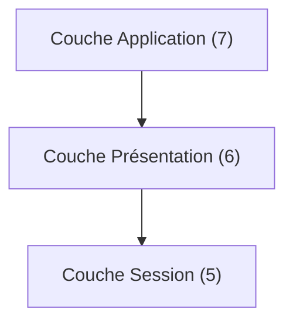

---
aliases:
  - Couche Présentation
  - Presentation Layer
  - OSI Layer 6
  - Couche 6
archetype: modele
cssclasses:
  - max
tags:
  - modele-osi
  - modele-osi/couche-6
  - chiffrement
  - compression
  - encoding
  - interoperabilite
  - donnee/structure
  - test
---

# Modèle : Couche Présentation (Couche 6)

> [!abstract] Principe Fondamental
> La couche Présentation (Couche 6) du modèle OSI assure la **traduction**, le **formatage** et la **préparation** des données pour la couche Application, garantissant que les informations échangées sont comprises par les applications des systèmes communicants, indépendamment de leurs formats internes natifs.

## 📐 Structure du Modèle

## 🧠 Concepts Clés
La couche Présentation, ou *Presentation Layer*, est la sixième couche du modèle OSI (Open Systems Interconnection). Elle se situe entre la couche Application (7) et la couche Session (5), agissant comme un traducteur et un facilitateur pour les données échangées entre différentes applications.

*   **Rôle Principal et Fonctionnement** :
    Le rôle fondamental de la couche Présentation est de **s'occuper de la syntaxe et de la sémantique des informations** transmises. Elle assure que les données sont présentées dans un format compréhensible par la couche Application, même si les systèmes communicants utilisent des représentations de données différentes en interne. C'est une couche de **traduction** et de **transformation** des données.
    Lorsque des données sont envoyées de l'application, la couche Présentation les formate pour la transmission sur le réseau. Lors de la réception, elle les reformate pour qu'elles soient utilisables par l'application destinataire.

*   **Fonctions Principales** :
    *   **Traduction de données (Traduction de format)** : Elle convertit les données d'un format spécifique à l'application vers un format générique pour la transmission, et inversement. Par exemple, elle peut traduire des données ASCII en EBCDIC ou inversément, ou convertir des entiers, des nombres flottants ou des chaînes de caractères entre différentes représentations spécifiques aux systèmes.
    *   **Compression des données** : Pour réduire le nombre de bits à transmettre et ainsi optimiser la bande passante et le temps de transmission, la couche Présentation peut compresser les données à l'envoi et les décompresser à la réception.
    *   **Chiffrement et Déchiffrement des données** : Pour des raisons de sécurité, cette couche est souvent responsable du chiffrement des données avant la transmission et de leur déchiffrement à la réception, assurant la confidentialité des informations.
    *   **Standardisation de format** : Elle peut standardiser les formats de données utilisés pour la communication afin de garantir l'interopérabilité entre des systèmes hétérogènes.

*   **Relation avec les couches adjacentes** :
    *   **Relation avec la Couche Application (Couche 7)** : La couche Présentation fournit des services à la couche Application. Elle prend les données brutes ou formatées de l'application et les prépare pour la transmission (compression, chiffrement, traduction). À la réception, elle prend les données de la couche Session et les transforme dans un format que l'application peut comprendre et utiliser directement. La couche Application interagit directement avec l'utilisateur et ses applications, tandis que la couche Présentation assure que ces applications reçoivent les données dans un format adéquat.
    *   **Relation avec la Couche Session (Couche 5)** : La couche Présentation utilise les services de la couche Session pour établir, maintenir et terminer les sessions de communication. La couche Session est responsable de la coordination du dialogue, tandis que la couche Présentation se concentre sur le formatage et la présentation des données qui transitent pendant cette session. La couche Présentation remet des données déjà formatées, compressées ou chiffrées à la couche Session pour leur transfert fiable, et reçoit les données de la couche Session avant de les traiter pour l'application.

*   **Exemples Concrets de Services ou Formats Gérés** :
    La couche Présentation gère divers formats de données qui nécessitent une interprétation standardisée ou une conversion :
    *   **JPEG (Joint Photographic Experts Group)** : Format de compression d'images, la couche Présentation peut être impliquée dans la compression ou décompression d'images JPEG.
    *   **MPEG (Moving Picture Experts Group)** : Standards de compression vidéo et audio, où la couche Présentation gère l'encodage et le décodage des flux.
    *   **MIDI (Musical Instrument Digital Interface)** : Protocole pour les instruments de musique électroniques, la couche Présentation pourrait s'occuper de la représentation des données musicales.
    *   **ASCII (American Standard Code for Information Interchange)** : Représentation standard des caractères textuels. La couche Présentation peut traduire entre ASCII et d'autres encodages.
    *   **EBCDIC (Extended Binary Coded Decimal Interchange Code)** : Un autre encodage de caractères utilisé principalement sur les grands systèmes IBM. La couche Présentation peut effectuer la conversion entre ASCII et EBCDIC.
    *   **TLS/SSL (Transport Layer Security / Secure Sockets Layer)** : Bien que souvent associée à la couche Transport, les aspects de chiffrement et de déchiffrement des données effectués par TLS/SSL sont conceptuellement liés aux fonctions de sécurité de la couche Présentation.
    *   **XML, JSON** : Ces formats de données structurées nécessitent une interprétation et une validation pour les applications, ce qui peut être un rôle de la couche Présentation.

## ✅ Avantages vs Inconvénients
| Avantages | Inconvénients |
|---|---|
| Assure l'interopérabilité entre systèmes hétérogènes en traduisant les formats de données. | Peut ajouter une surcharge de traitement (latence) due aux opérations de conversion, compression ou chiffrement. |
| Permet la compression des données, réduisant ainsi la bande passante nécessaire et améliorant les performances du réseau. | Les fonctions de chiffrement/déchiffrement et compression/décompression sont souvent gérées par des applications de la couche supérieure ou directement par le système d'exploitation, rendant cette couche parfois redondante dans les implémentations modernes. |
| Gère le chiffrement/déchiffrement des données, améliorant la sécurité des communications. | Le modèle OSI est un modèle théorique ; la couche Présentation n'est pas toujours clairement distincte ou implémentée comme une couche séparée dans les piles de protocoles réelles (comme TCP/IP). |
| Fournit une abstraction aux couches supérieures en masquant les détails de représentation des données. | La complexité de la gestion de tous les formats de données possibles peut être élevée. |