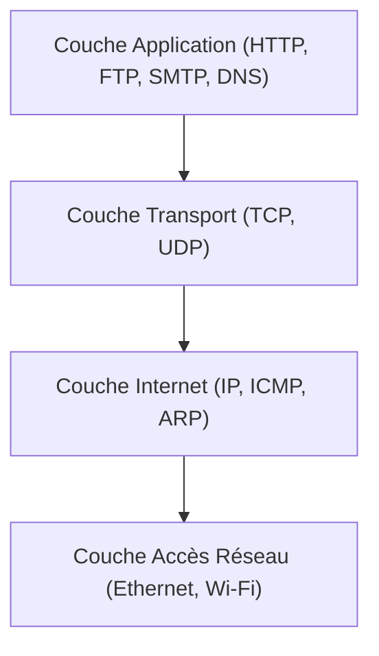

---
aliases:
  - Couche Application
  - Application Layer
  - Couche Application TCP/IP
  - TCP/IP Application Layer
archetype: modele
cssclasses:
  - max
tags:
  - modele-tcp-ip
  - modele-tcp-ip/couche-application
  - modele-osi
  - protocole/http
  - protocole/https
  - protocole/ftp
  - protocole/smtp
  - protocole/dns
  - protocole/telnet
  - protocole/pop3
  - protocole/imap
  - reseau
  - communication/reseau
---

# Modèle : Couche Application TCP/IP

> [!abstract] Principe Fondamental
> La couche Application du modèle TCP/IP est la couche supérieure qui fournit l'interface entre les applications utilisateur et les services réseau, permettant la communication et l'échange de données via des protocoles spécifiques.

## 📐 Structure du Modèle

## 🧠 Concepts Clés
*   **Fonctions Principales** : La couche Application est la couche la plus élevée du modèle TCP/IP, interagissant directement avec les applications logicielles et les utilisateurs finaux. Elle fournit des fonctionnalités pour les services tels que le *courrier électronique*, la *navigation web* et les *transferts de fichiers*. Cette couche est responsable de la présentation des données dans un format compréhensible par l'utilisateur et de la transmission des requêtes utilisateur à la couche de transport. Elle permet aux périphériques d'accéder au réseau et aux applications, telles que les e-mails et le stockage cloud.
*   **Exemples de Protocoles** :
    *   **HTTP (Hypertext Transfer Protocol) / HTTPS**: Utilisé pour l'accès aux informations disponibles sur Internet et la communication sécurisée entre les navigateurs web et les serveurs web.
    *   **FTP (File Transfer Protocol)**: Permet le transfert de fichiers entre des systèmes, comme le téléchargement ou l'envoi de documents.
    *   **SMTP (Simple Mail Transfer Protocol)**: Protocole standard pour l'envoi de courriers électroniques entre serveurs de messagerie.
    *   **DNS (Domain Name System)**: Traduit les noms de domaine lisibles par l'homme en adresses IP numériques.
    *   **Telnet**: Permet la connexion et le contrôle à distance d'un ordinateur.
    *   **POP3 (Post Office Protocol 3) & IMAP (Internet Message Access Protocol)**: Protocoles utilisés par les clients de messagerie pour récupérer les e-mails des serveurs.
*   **Importance** : La couche Application est cruciale car elle fournit les services réseau directement aux utilisateurs et aux applications, masquant la complexité des couches inférieures. Elle est le point d'interaction pour la majorité des logiciels réseau, des navigateurs aux applications de messagerie.

## ✅ Avantages vs Inconvénients
| Avantages | Inconvénients |
|---|---|
| **Flexibilité et Interopérabilité** : Le modèle TCP/IP est une norme ouverte et évolutive, facilitant la connexion entre différents types d'ordinateurs et de systèmes d'exploitation. Il est largement utilisé dans les structures réseau modernes et adaptable à diverses applications. | **Agrégation de Fonctions** : La couche Application du modèle TCP/IP regroupe les fonctions des couches Session, Présentation et Application du modèle OSI. Cette consolidation peut rendre le dépannage des problèmes ou l'amélioration des performances plus complexe en raison d'une segmentation moins fine des responsabilités. |
| **Centré sur l'utilisateur** : Elle offre une interface directe et intuitive pour les applications et les utilisateurs finaux, rendant les services réseau essentiels accessibles et exploitables. | **Manque de Distinction Conceptuelle Claire** : Le modèle TCP/IP ne distingue pas toujours clairement les notions de service, d'interface et de protocole. Cela peut être un désavantage lors de la description ou de l'intégration de nouvelles technologies, car les rôles sont moins strictement définis que dans le modèle OSI. |
| **Richesse des protocoles** : L'existence d'un vaste ensemble de protocoles standardisés (HTTP, FTP, SMTP, DNS, etc.) permet une grande diversité de services réseau, couvrant presque tous les besoins de communication moderne. | |
## 🔗 Notes Connexes
* [[ApplicationLayer|OSI Layer 7]]
* [[PresentationLayer|OSI Layer 6]]
* [[OsiSessionLayer|OSI Layer 5]]