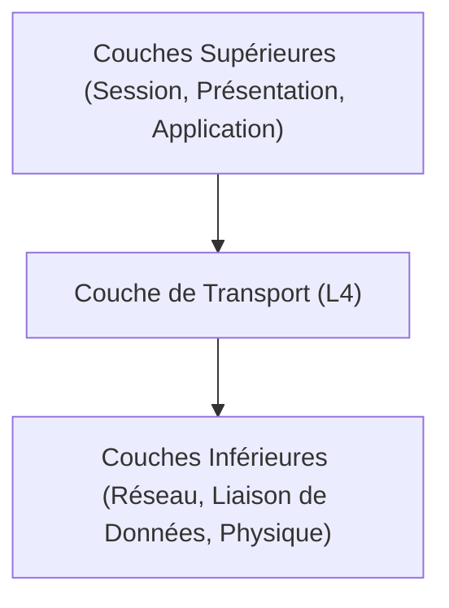

---
aliases:
  - Couche de Transport
  - Transport Layer
  - OSI Layer 4
  - TCP/UDP Layer
  - Couche 4 OSI
  - Couche 4
archetype: modele
cssclasses:
  - max
tags:
  - modele
  - modele-osi
  - modele-osi/couche-4
  - protocole/tcp
  - protocole/udp
  - reseau
  - reseau/communication
  - segmentation
  - application
  - fiabilite
  - disponibilite
  - latence
  - modele-osi/couche-4/multiplexage
  - modele-osi/couche-4/demultiplexage
  - protocole/tcp/controle-flux
  - protocole/tcp/controle-erreur
---

# Modèle : Transport Layer (OSI Layer 4)

> [!abstract] Principe Fondamental
> La **couche de transport** (Couche 4) du modèle OSI est responsable de la communication de bout en bout entre les applications sur différents hôtes, garantissant un transfert de données fiable et ordonné, ou un transfert rapide mais non garanti, selon le protocole utilisé.

## 📐 Structure du Modèle

## 🧠 Concepts Clés
*   **Segmentation et Réassemblage** : La couche de transport divise les données des couches supérieures en segments (pour TCP) ou datagrammes (pour UDP) à l'envoi, et les réassemble dans le bon ordre à la réception, assurant que les données sont intactes pour les applications.
*   **Multiplexage et Démultiplexage** : Cette fonction permet à plusieurs applications d'utiliser la même connexion réseau simultanément (multiplexage) et de diriger les données entrantes vers l'application correcte à l'aide de numéros de port (démultiplexage).
*   **Communication de bout en bout** : La couche de transport établit une connexion logique entre les processus applicatifs des systèmes source et destination, contrairement aux couches inférieures qui gèrent la livraison hôte à hôte.
*   **Contrôle de flux** : Pour les protocoles fiables comme TCP, le contrôle de flux empêche un expéditeur rapide de submerger un récepteur lent en gérant la quantité de données envoyées avant de recevoir un accusé de réception.
*   **Contrôle d'erreur** : Les protocoles fiables (TCP) détectent les segments perdus, corrompus ou dupliqués et demandent leur retransmission pour garantir l'intégrité des données.
*   **TCP (Transmission Control Protocol)** : Un protocole orienté connexion qui fournit un service de transport fiable, ordonné et avec contrôle de flux. Il est utilisé pour les applications nécessitant une livraison de données garantie, comme la navigation web (HTTP), le courrier électronique (SMTP) et le transfert de fichiers (FTP).
*   **UDP (User Datagram Protocol)** : Un protocole sans connexion, non fiable, qui offre un service de transport rapide mais sans garantie de livraison, d'ordre ou de contrôle de flux. Il est utilisé pour les applications où la vitesse est plus critique que la fiabilité, comme le streaming vidéo/audio, les jeux en ligne et le DNS.

## ✅ Avantages vs Inconvénients
| Avantages | Inconvénients |
|---|---|
| **Fiabilité** (avec TCP) : Assure la livraison, l'ordre et l'intégrité des données grâce à des accusés de réception et retransmissions. | **Surcharge (overhead)** (avec TCP) : Nécessite des ressources supplémentaires (bande passante, temps de traitement) pour la gestion des connexions, le contrôle de flux et d'erreur. |
| **Indépendance de l'application** : Fournit une interface de service standardisée aux couches supérieures, indépendamment des spécificités du réseau sous-jacent. | **Complexité** (avec TCP) : La mise en œuvre des mécanismes de fiabilité, de contrôle de flux et de congestion peut être complexe. |
| **Efficacité** (avec UDP) : Permet une communication rapide avec un faible délai grâce à l'absence de mécanismes de fiabilité ou de contrôle de flux. | **Manque de fiabilité** (avec UDP) : Les paquets peuvent être perdus, dupliqués ou reçus dans le désordre sans mécanisme de correction intégré. |
| **Multiplexage/Démultiplexage** : Permet à plusieurs applications de partager la même connexion réseau, maximisant l'utilisation des ressources. | **Sensibilité aux erreurs réseau** (avec UDP) : Les applications doivent gérer elles-mêmes la fiabilité ou tolérer la perte de données. |
## 🔗 Notes Connexes
* [[TransportLayerTCPIP|Couche Transport TCP/IP]]