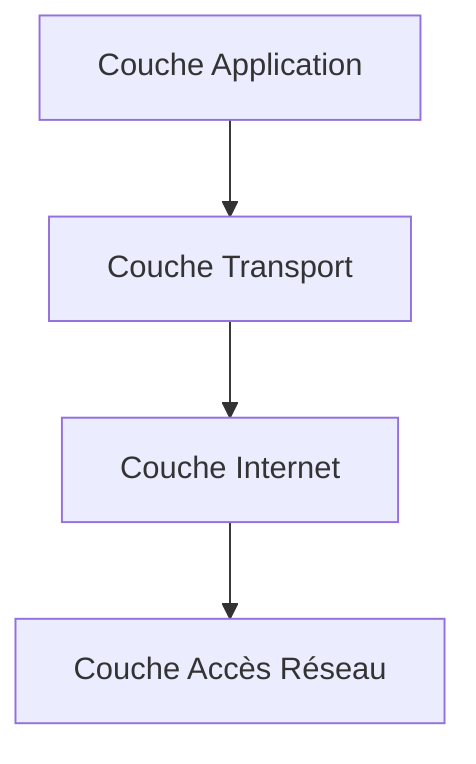

---
aliases:
  - Couche Transport TCP/IP
  - Couche de Transport
  - TCP/IP Transport Layer
  - Transport Layer
  - TCP
  - UDP
archetype: modele
cssclasses:
  - max
tags:
  - modele-tcp-ip
  - modele-tcp-ip/couche-transport
  - communication/reseau
  - modele-tcp-ip/couche-transport/multiplexage
  - modele-tcp-ip/couche-transport/demultiplexage
  - segmentation
  - communication/controle-flux
  - protocole/tcp/controle-congestion
  - fiabilite
  - protocole/orientee-connexion
  - protocole/sans-connexion
  - port
  - mtu
  - protocole/tcp
  - protocole/udp
  - protocole/http
  - protocole/smtp
  - protocole/pop3
  - protocole/ftp
  - protocole/dns
  - latence
---

# Modèle : Couche Transport TCP/IP

> [!abstract] Principe Fondamental
> La couche Transport du modèle TCP/IP assure la communication de bout en bout entre les applications sur différents hôtes, en gérant la segmentation, le multiplexage et, pour certains protocoles, la fiabilité et le contrôle de flux.

## 📐 Structure du Modèle

## 🧠 Concepts Clés
*   **Communication de bout en bout (End-to-End)** : La couche Transport établit une connexion logique entre les processus applicatifs s'exécutant sur les hôtes source et destination, et non seulement entre les hôtes.
*   **Multiplexage et Démultiplexage** : Elle permet à plusieurs applications d'utiliser simultanément le même réseau en attribuant des numéros de *port* (adresses de port source et destination) aux applications, et achemine les données vers l'application correcte à l'arrivée.
*   **Segmentation des données** : Les données des applications sont divisées en segments plus petits pour être transmises sur le réseau, adaptés à la taille maximale d'unité de transmission (MTU) des couches inférieures.
*   **Contrôle de flux (Flow Control)** : Permet de gérer la quantité de données envoyées par l'émetteur pour éviter de submerger le récepteur.
*   **Contrôle de congestion (Congestion Control)** : Aide à prévenir la surcharge du réseau en ajustant le taux de transmission des données.
*   **Fiabilité (Reliability)** : Pour les protocoles orientés connexion, elle garantit que les données arrivent complètes, sans erreurs et dans le bon ordre, grâce à des mécanismes de séquencement, d'accusé de réception (ACK) et de retransmission des paquets perdus ou corrompus.
*   **Orientation connexion vs. Sans connexion** : La couche Transport héberge des protocoles qui peuvent être soit orientés connexion (établissement d'une session avant la transmission, comme TCP), soit sans connexion (envoi de datagrammes sans établissement préalable, comme UDP).

## 🌐 Protocoles Majeurs

### Transmission Control Protocol (TCP)
*   **Type** : Protocole orienté connexion.
*   **Fiabilité** : Assure une livraison fiable des données, avec correction d'erreurs, séquencement des paquets et retransmission des données perdues.
*   **Contrôle** : Intègre le contrôle de flux et le contrôle de congestion pour optimiser la transmission.
*   **Utilisation** : Idéal pour les applications nécessitant une intégrité des données, telles que la navigation web (HTTP), le courrier électronique (SMTP, POP) et le transfert de fichiers (FTP).
*   **En-tête** : Possède une taille d'en-tête de 20 octets.

### User Datagram Protocol (UDP)
*   **Type** : Protocole sans connexion (connectionless).
*   **Rapidité** : Privilégie la vitesse et la faible latence par rapport à la fiabilité.
*   **Fiabilité** : N'offre aucune garantie de livraison, d'ordre ou de correction d'erreurs, agissant comme un protocole "fire-and-forget".
*   **Utilisation** : Convient aux applications où la vitesse est plus critique que la fiabilité totale, comme le streaming vidéo en direct, les jeux en ligne et les requêtes DNS.
*   **En-tête** : Possède une taille d'en-tête de 8 octets.

## ✅ Avantages vs Inconvénients
| Avantages (de la couche Transport et ses protocoles) | Inconvénients (selon les protocoles) |
|---|---|
| Fournit une communication logique de bout en bout entre les applications. | **TCP** : Overhead plus élevé et latence accrue en raison des mécanismes de fiabilité (établissement de connexion, accusés de réception, retransmissions). |
| Permet le multiplexage de session, supportant de multiples communications simultanées. | **UDP** : Manque de fiabilité ; les paquets peuvent être perdus, dupliqués ou arriver dans le désordre sans mécanisme de récupération intégré. |
| **TCP** garantit la livraison fiable et ordonnée des données, essentielle pour de nombreuses applications. | **UDP** : Ne gère pas le contrôle de flux ni le contrôle de congestion, laissant cette responsabilité à l'application. |
| **UDP** offre une transmission rapide avec un faible overhead, idéale pour les applications sensibles à la latence. | La **couche Transport** elle-même ne garantit pas toujours que les données arriveront dans l'ordre correct ou non corrompues sans les mécanismes de TCP. |
## 🔗 Notes Connexes
* [[TransportLayer|OSI Layer 4]]