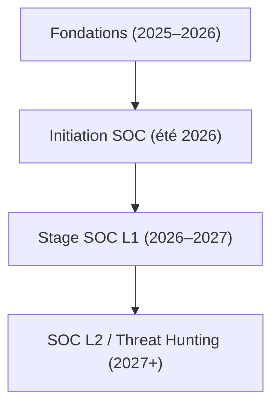

---
tags:
  - carriere/soc
  - cybersecurite/operations
  - analyse/menaces
  - reponse-incident
  - formation/julien
  - objectifs/personnels
aliases:
  - Roadmap SOC Analyst — Mon Parcours
archetype: carriere
cssclasses:
  - max
---

# 🛡️ Roadmap SOC Analyst — Mon Parcours

Cette feuille de route détaille mon évolution prévue dans la cybersécurité, dans le cadre de ma formation IFAPME (2025–2027).  
Mon objectif est clair : **avoir les compétences essentielles d’un [[SOCAnalyst|SOC Analyst]] L1 d’ici juillet–août 2026**, afin d’arriver prêt pour mon **stage en deuxième année (septembre 2026 → juin 2027)**.

---

# 🔰 1. Fondations essentielles (Maintenant → Juillet 2026)

Avant l’été 2026, je dois maîtriser tout ce qui me permettra de comprendre une alerte, un log ou un comportement réseau.

### Réseau
- [[OsiModel|Modèle OSI]]  
- [[TcpIpModel|Modèle TCP/IP]]  
- [[CommonPortsAndProtocols|Ports et protocoles courants]]  
- [[DomainNameSystem|DNS]], [[DHCP]], [[NetworkAddressTranslation|NAT]]  
- [[RoutingConcepts|Notions de routage]]  

### Systèmes

**Windows :**
-  [[EventViewer|Event Viewer]] 
- [[Sysmon]]  
- [[PowerShell]] (bases)

**Linux :**
- [[Journalctl]]  
- Commandes essentielles (ps, top, grep, netstat…)

### Cybersécurité générale
- [[CIATriad|Triade CIA]]  
- [[Vulnerabilities|Vulnérabilités]] courantes  
- Types d’attaques (phishing, brute-force, malware…)  
- Référentiel [[MitreAttackFramework|MITRE ATT&CK]] (5–10 techniques)

---

# 🔰 2. Initiation SOC (Mai → Août 2026)

Durant cette période, j’apprends à manipuler un SIEM et à comprendre le fonctionnement pratique d’un SOC.

### [[SIEM]]
- Installation ou test : [[Wazuh]] (prioritaire) ou [[SplunkFree|Splunk Gratuit]]  
- Comprendre la structure d’une alerte  
- Faire la différence entre **vrai positif** et **faux positif**

### Analyse de logs
- Lire des logs Windows et Linux  
- Relever ce qui semble anormal  
- Justifier clairement pourquoi

### Réponse à incident (bases)
- Détection  
- Analyse rapide  
- Confinement  
- Récupération  

---

# 🔰 3. Préparation du stage SOC (Septembre 2026 → Juin 2027)

À l’arrivée en stage, je dois être capable de fonctionner comme un analyste L1 débutant.

### Compétences à renforcer
- Corrélations simples  
- Utilisation concrète de MITRE pour analyser une alerte  
- [[RegularExpressions|Regex]] (niveau débutant)  
- PowerShell (niveau débutant)  
- Threat Intelligence : IOC, TTP

### Organisation dans mon Vault
- Notes atomiques propres  
- Section dédiée : `Cyber/SOC/Roadmap_Julien`  
- Exercices mensuels  
- Logs d’entraînement (normaux vs anormaux)

---

# 🔰 4. Progression naturelle (Après le stage)

### SOC L2
- Analyse plus avancée  
- Compréhension des chaînes d’attaque  
- Exploration approfondie des logs et comportements suspects

### Threat Hunting  
(Optionnel, mais très aligné avec ma manière de penser)
- Recherche proactive  
- Détection comportementale  
- Utilisation avancée de MITRE  

---

# 🔰 Diagramme de progression (compatible Obsidian)

