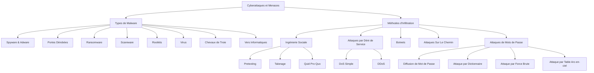

---
tags:
  - cour
  - iic
aliases:
  - Types de Malware et Méthodes d'Infiltration
  - 03-04 | Types de Malware et Méthodes d'Infiltration
archetype: cour
module: "IIC (Introduction à l'informatique et cybersécurité)"
cssclasses:
  - max
---

# 03-04 | Types de Malware et Méthodes d'Infiltration

> [!GOAL] Objectifs Pédagogiques
> À la fin de cette fiche, je dois être capable de :
> 1. Identifier et distinguer les principaux types de [[Malware|logiciels malveillants]], leurs caractéristiques et leurs modes de fonctionnement.
> 2. Décrire les différentes [[InfiltrationMethods|méthodes d'infiltration]] utilisées par les cybercriminels, incluant l'[[SocialEngineering|ingénierie sociale]] et les [[PasswordAttacks|attaques de mots de passe]].
> 3. Expliquer les symptômes courants d'une infection par un [[Malware]] et lister les mesures préventives essentielles.

## 📝 Synthèse du Cours

Cette leçon explore les diverses catégories de [[Malware|logiciels malveillants]] et les techniques d'[[InfiltrationMethods|infiltration]] employées par les cybercriminels pour compromettre les systèmes et les données. Comprendre ces menaces est fondamental pour une protection efficace.

### 1. Types de Logiciels Malveillants

#### Logiciels Espions et Publicitaires
*   **[[Spyware|Logiciel Espion]]** : Conçu pour surveiller l'activité en ligne, enregistrer les frappes au clavier et capturer les [[SensitiveData|données sensibles]] (ex: coordonnées bancaires) en modifiant les paramètres de sécurité.
*   **Logiciel Publicitaire (Adware)** : S'installe souvent avec d'autres logiciels et distribue automatiquement des publicités intrusives dans le navigateur, difficiles à ignorer.

#### [[Backdoor|Porte Dérobée]] et [[Ransomware]]
*   **[[Backdoor|Porte Dérobée]]** : Permet de contourner les procédures d'[[Authentication|authentification]] normales pour un accès distant non autorisé. Elles sont difficiles à détecter car elles opèrent en arrière-plan.
*   **[[Ransomware]]** : Chiffre les données ou bloque l'accès au système, exigeant une rançon pour la restauration. Se propage fréquemment via des [[Phishing|e-mails de phishing]] contenant des pièces jointes malveillantes.

#### [[Scareware]] et [[Rootkit]]
*   **[[Scareware]]** : Utilise des tactiques de peur (fausses alertes de sécurité) pour inciter l'utilisateur à installer un programme malveillant qui infectera le système.
*   **[[Rootkit]]** : Modifie le [[OperatingSystem|système d'exploitation]] pour créer une [[Backdoor|porte dérobée]], élever les privilèges et masquer sa présence, rendant sa détection très difficile.

#### [[Virus]] Informatiques
*   Un [[Virus]] est un [[Code|programme]] qui se réplique et s'attache à d'autres [[Execution|fichiers exécutables]] après son [[Execution|exécution]]. La plupart nécessitent une interaction utilisateur pour s'activer.
*   **Activation** : Généralement par une action de l'utilisateur.
*   **Réplication** : Se copie et s'attache à d'autres fichiers exécutables.
*   **Propagation** : Se répand via [[USB]], disques optiques, partages [[Network|réseau]] ou [[Email|e-mail]].

#### [[Trojan|Chevaux de Troie]] et [[Worm|Vers]]
*   **[[Trojan|Cheval de Troie]]** : Masque ses intentions malveillantes derrière une apparence légitime (ex: fichiers multimédias, jeux). Ne se reproduit pas automatiquement, contrairement aux [[Virus]].
*   **[[Worm|Ver Informatique]]** : Se réplique de manière autonome et se propage d'[[Computer|ordinateur]] en [[Computer|ordinateur]] sans nécessiter de [[Process|programme]] hôte ou d'interaction utilisateur, pouvant infecter rapidement un [[Network|réseau]].

### 2. Symptômes d'Infection par Malware
Les signes d'une infection par un [[Malware]] incluent :
*   **Performance Dégradée** : Augmentation de l'utilisation du [[Kernel|CPU]], blocages, pannes, lenteur de navigation.
*   **Problèmes [[Network|Réseau]]** : Connexions [[Network|réseau]] inexplicables, [[Process|processus]] inconnus en [[Execution|exécution]].
*   **Fichiers Compromis** : Fichiers modifiés, supprimés, ou présence de fichiers/programmes inconnus.
*   **Activité Suspecte** : [[Email|e-mails]] envoyés à l'insu de l'utilisateur, icônes inconnues sur le bureau.

### 3. Méthodes d'Infiltration
Les cybercriminels exploitent diverses techniques pour infiltrer les systèmes :

#### [[SocialEngineering|Ingénierie Sociale]]
Manipulation d'individus pour qu'ils divulguent des informations confidentielles ou exécutent des actions.
*   **Pretexting** : Le hacker invente un scénario plausible pour obtenir des informations.
*   **Talonage (Tailgating)** : Suivre une personne autorisée pour accéder physiquement à une zone sécurisée.
*   **Quid Pro Quo** : Offrir un "cadeau" ou un "service" en échange d'informations personnelles.

#### [[DenialOfService|Attaques par Déni de Service]] (DoS/DDoS)
Visent à rendre un [[Service|service]] ou une [[Resource|ressource]] indisponible pour ses utilisateurs légitimes.
*   **[[DenialOfService|DoS]] Simple** : Surcharge le système avec un volume de [[NetworkTraffic|trafic]] qu'il ne peut gérer.
*   **[[DistributedDenialOfService|DDoS]]** : Attaque similaire mais provenant de multiples sources coordonnées, souvent un [[Botnet]].

#### [[Botnet]]
*   Un [[Botnet]] est un [[Network|réseau]] d'[[Computer|ordinateurs]] infectés (bots ou zombies) contrôlés par un attaquant via un [[CommandAndControl|serveur de commande et contrôle]]. Il est utilisé pour distribuer des [[Malware]], lancer des [[DistributedDenialOfService|attaques DDoS]] ou envoyer du spam.

#### Attaques Sur Le Chemin (Man-in-the-Middle)
*   Les attaques [[ManInTheMiddle|Man-in-the-Middle]] interceptent ou modifient les [[NetworkCommunication|communications]] entre deux entités pour collecter des informations ou usurper une [[DigitalIdentity|identité]].

#### [[PasswordAttacks|Attaques de Mots de Passe]]
*   **[[PasswordSpraying|Diffusion de Mot de Passe]]** : Tente quelques mots de passe courants sur un grand nombre de comptes pour éviter les blocages.
*   **[[DictionaryAttack|Attaque par dictionnaire]]** : Essaie des mots de passe à partir d'une liste prédéfinie de mots courants.
*   **[[BruteForceAttack|Attaque par force brute]]** : Tente toutes les combinaisons possibles de caractères jusqu'à trouver le bon [[Password|mot de passe]].
*   **[[RainbowTableAttack|Attaque par table arc-en-ciel]]** : Compare le [[Hashing|hash]] d'un [[Password|mot de passe]] avec ceux d'une table précalculée pour trouver la correspondance.

### 4. Protection et Vigilance
La [[Cybersecurity|cybersécurité]] exige une approche multicouche, combinant technologies (comme le [[Encryption|chiffrement]]) et [[SecurityAwareness|sensibilisation des utilisateurs]].
*   **[[Encryption|Chiffrement]]** : Protéger les [[NetworkCommunication|communications]] et les [[SensitiveData|données sensibles]].
*   **[[StrongPassword|Mots de Passe Forts]]** : Utiliser des [[Password|mots de passe]] complexes et uniques.
*   **Vigilance** : Être alerte aux tentatives d'[[SocialEngineering|ingénierie sociale]] et aux [[Email|e-mails]] suspects.

> [!NOTE] Définition Clé
> **[[Malware]]** : Contraction de "malicious software", un [[Software|logiciel]] conçu pour causer des dommages, infiltrer ou accéder à un [[Computer|système]] sans le consentement de l'utilisateur.

## 🧠 Carte Mentale / Schéma

## ❓ Quiz de Révision (Active Recall)
> [!QUESTION] Question 1
> Quelles sont les principales différences entre un [[Trojan|Cheval de Troie]] et un [[Worm|Ver Informatique]] en termes de reproduction et de propagation ?
> > [!success]- Réponse
> > Un [[Trojan|Cheval de Troie]] est un [[Malware]] qui se déguise en [[SoftwareApplication|logiciel]] légitime pour tromper l'utilisateur. Il ne se reproduit pas automatiquement et nécessite souvent une interaction de l'utilisateur pour son [[Execution|exécution]]. Un [[Worm|Ver Informatique]], en revanche, est un [[Malware]] autonome qui se réplique et se propage d'[[Computer|ordinateur]] en [[Computer|ordinateur]] à travers un [[Network|réseau]] sans nécessiter de programme hôte ou d'intervention humaine.

> [!QUESTION] Question 2
> Décrivez au moins trois méthodes d'[[SocialEngineering|ingénierie sociale]] et expliquez brièvement comment elles sont utilisées par les cybercriminels.
> > [!success]- Réponse
> > 1. **Pretexting** : Le cybercriminel crée un faux scénario (prétexte) pour manipuler une victime et obtenir des informations sensibles.
> > 2. **Talonage (Tailgating)** : L'attaquant suit une personne autorisée pour accéder physiquement à une zone restreinte sans [[Authentication|authentification]].
> > 3. **Quid Pro Quo** : L'attaquant offre un petit avantage (ex: "aide technique" ou cadeau) en échange d'informations ou d'accès.

> [!QUESTION] Question 3
> Enumérez quatre types d'[[PasswordAttacks|attaques de mots de passe]] et expliquez le principe de chacune.
> > [!success]- Réponse
> > 1. **[[PasswordSpraying|Diffusion de Mot de Passe]]** : Utilise un petit nombre de [[Password|mots de passe]] très courants contre un grand nombre de [[Account|comptes]] différents pour éviter les blocages de compte.
> > 2. **[[DictionaryAttack|Attaque par dictionnaire]]** : Tente de deviner les [[Password|mots de passe]] en essayant tous les mots d'une liste (dictionnaire) de mots et phrases couramment utilisés.
> > 3. **[[BruteForceAttack|Attaque par force brute]]** : Essaie systématiquement toutes les combinaisons possibles de caractères (lettres, chiffres, symboles) jusqu'à trouver le [[Password|mot de passe]] correct.
> > 4. **[[RainbowTableAttack|Attaque par table arc-en-ciel]]** : Utilise des tables précalculées de [[Hashing|hashs]] de [[Password|mots de passe]] pour retrouver rapidement le mot de passe original à partir de son [[Hashing|hash]].

## 🔗 Notes Connexes
*   **Module parent**: [[IIC00-00_Introduction|Introduction à l'informatique et à la cybersécurité]]
*   **Cours précédent**: [[IIC03-03_VulnerabilitesEtSecuriteInformatique|Vulnérabilités et Sécurité Informatique]]
*   **Cours suivant**: 