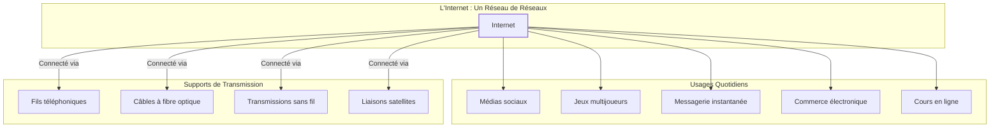

---
tags:
  - cour
  - rib
aliases:
  - Module 1
  - 01-01 | Module 1
archetype: cour
module: "RIB (Introduction au réseau)"
cssclasses:
  - max
---

# 01-01 | Module 1

> [!GOAL] Objectifs Pédagogiques
> À la fin de cette fiche, je dois être capable de :
> 1. Comprendre la nature omniprésente d'Internet dans la vie quotidienne et ses méthodes de transmission.
> 2. Identifier les différents types de réseaux et les avantages qu'ils procurent aux entreprises.
> 3. Distinguer les divers appareils connectés et leurs applications dans le concept d'[[InternetofThings|Internet des Objets]] (IoT).
> 4. Expliquer les concepts fondamentaux du langage [[BinaryDigit|binaire]] des ordinateurs et du [[ASCII|Code ASCII]].
> 5. Différencier la [[Bandwidth|bande passante]], le [[Throughput|débit réel]] et la [[Latency|latence]] dans la [[DataTransmission|transmission des données]].

## 📝 Synthèse du Cours

### 1. L'omniprésence d'Internet

[[Internet]] est aujourd'hui une partie tellement intégrante de nos vies qu'il est souvent considéré comme acquis. Nous attendons de nos [[EndDevices|appareils]] une [[NetworkCommunication|connectivité permanente]] pour communiquer, acheter, partager et apprendre. Cette omniprésence est la fondation de notre ère numérique.

### 2. Qu'est-ce qu'Internet et ses Supports de Transmission

[[Internet]] est un ensemble mondial de [[InterconnectedNetworks|réseaux interconnectés]] qui coopèrent pour échanger des [[Data|informations]] en utilisant des normes communes. Il n'est la propriété d'aucun individu ou groupe. La [[DataTransmission|transmission des données]] sur [[Internet]] s'appuie sur diverses méthodes et supports :
*   **[[ElectricalSignals|Signaux électriques]]** : Utilisés par les [[CopperWire|fils téléphoniques]] (câbles cuivre) pour les connexions traditionnelles, notamment pour les [[LocalAreaNetwork|réseaux locaux]].
*   **[[OpticalSignals|Signaux optiques]]** : Transmis par les [[FiberOpticCable|câbles à fibre optique]] sous forme d'[[LightPulses|impulsions lumineuses]], offrant une [[DigitalBandwidth|transmission]] à haute vitesse sur de longues distances.
*   **[[RadioWaves|Signaux sans fil]]** : Incluent les [[InfraredWaves|ondes infrarouges]], les [[Microwaves|micro-ondes]] et les [[RadioWaves|ondes radio]] (comme le [[WirelessFidelity|Wi-Fi]] et [[Bluetooth|Bluetooth]]), permettant une grande flexibilité de connexion à travers l'air.
*   **[[SatelliteLinks|Liaisons satellites]]** : Essentielles pour les [[NetworkCommunication|communications]] couvrant les zones isolées où les infrastructures terrestres sont limitées.

> [!NOTE] Définition Clé
> **[[Internet]]** : Un ensemble mondial de [[InterconnectedNetworks|réseaux interconnectés]] qui coopèrent pour échanger des [[Data|informations]] sous toutes ses formes, n'appartenant à aucun individu ou groupe.

### 3. Types de Réseaux et leurs Avantages

Les [[Network|réseaux]] peuvent varier considérablement en taille et complexité, allant des connexions basiques aux infrastructures d'entreprise sophistiquées :
*   **[[HomeNetwork|Petits réseaux domestiques]]** : Connectent quelques ordinateurs entre eux et à [[Internet]] dans un foyer.
*   **[[SOHONetwork|Réseaux SOHO]]** (Small Office/Home Office) : Conçus pour les petits bureaux ou bureaux à domicile, ils facilitent le partage de [[Resource|ressources]] (imprimantes, fichiers, [[Internet]]).
*   **[[EnterpriseNetwork|Réseaux d'entreprise]]** : De grande taille, ils connectent des centaines, voire des milliers d'[[EndDevices|appareils]], et transforment les opérations commerciales grâce à des [[NetworkCommunication|communications]] plus efficaces et économiques.
*   **[[Internet|Réseaux mondiaux]]** : L'[[Internet]] lui-même est le plus grand [[InterconnectedNetworks|réseau mondial]], connectant des centaines de millions d'ordinateurs.

Les [[EnterpriseNetwork|réseaux d'entreprise]] offrent des avantages significatifs :
*   **Vente et Marketing** : Permettent d'annoncer et de vendre des produits efficacement via les [[DigitalContent|plateformes numériques]].
*   **Approvisionnement** : Facilitent la [[CentralizedAdministration|gestion]] et l'exécution des achats auprès des fournisseurs de manière rationalisée.
*   **[[NetworkCommunication|Communication Client]]** : Maintiennent des relations client robustes via [[Email|emails]] et messagerie instantanée.
*   **[[DataManagement|Gestion des Données]]** : Assurent la [[Data|consolidation]] et l'[[AccessControlModel|accès]] sécurisé aux [[Data|informations]] stockées sur des [[FileServer|serveurs réseau]].

### 4. Dispositifs Connectés et l'Internet des Objets (IoT)

L'[[Internet]] connecte bien plus que les ordinateurs traditionnels. Une multitude d'[[MobileDevice|appareils mobiles]] et d'objets du quotidien enrichissent notre environnement grâce à leur [[NetworkCommunication|connectivité permanente]], formant l'[[InternetofThings|Internet des Objets]] (IoT).

*   **[[MobileDevice|Appareils Mobiles Connectés]]** :
    *   **Smartphone** : Combine téléphone, appareil photo, [[LocationData|GPS]], lecteur multimédia et ordinateur tactile, offrant une [[Internet|connexion Internet]] presque partout.
    *   **Tablette** : Parfaite pour le divertissement (vidéos, lecture) et les tâches informatiques de base grâce à des claviers virtuels.
    *   **[[Smartwatch|Montre connectée]]** : Fournit des alertes et messages, surveille le pouls et compte les pas pour contrôler la santé.
    *   **Lunettes connectées** : Représentent un ordinateur portable avec écran miniature et pavé tactile pour une navigation mains libres.

*   **[[InternetofThings|La Maison Connectée]] ([[InternetofThings]])** : De nombreux éléments domestiques peuvent être connectés à [[Internet]] pour [[SecurityMonitoring|surveillance]] et configuration à distance, transformant nos habitations en environnements intelligents.
    *   **Gestion Domestique** : Systèmes de sécurité, éclairage intelligent, climatisation automatisée.
    *   **Divertissement** : Télévisions intelligentes, consoles de jeux en ligne, systèmes audio connectés.
    *   **Électroménager** : Réfrigérateurs connectés, fours programmables, lave-vaisselle intelligents.
    *   **Contrôle Mobile** : Surveillance et configuration via smartphone ou tablette, avec alertes automatiques.

*   **[[InternetofThings|Autres Dispositifs Connectés]]** : Au-delà du domicile, de nombreux [[EndDevices|appareils connectés]] fournissent des [[Data|informations]] utiles, voire vitales.
    *   **Voitures intelligentes** : Accès aux cartes, contenu multimédia, alertes de vol et appels d'urgence automatiques.
    *   **Étiquettes RFID** : Identification par radiofréquence pour suivre et surveiller des objets dans diverses conditions.
    *   **Capteurs et Actionneurs** : Surveillance automatique de température, humidité, pression et déclenchement d'actions (ex: arrosage).
    *   **Appareillages médicaux** : Pacemakers, pompes à insuline et systèmes hospitaliers alertent patients et personnel médical.

### 5. Le Langage des Ordinateurs : Binaire et ASCII

Les ordinateurs et les [[Network|réseaux]] n'utilisent que des chiffres [[BinaryDigit|binaires]] : des zéros et des uns. Ce langage est la base de toute [[Programming|programmation]] et [[Data|traitement de données]].

*   **[[Bit|Définition du Bit]]** : Abréviation de "binary digit", le [[Bit|bit]] est la plus petite unité de [[Data|données]] et ne peut avoir que deux valeurs distinctes possibles : 0 ou 1.
*   **[[PhysicalStates|États Physiques]]** : Les 0 et 1 sont représentés physiquement par des directions magnétiques, des tensions électriques, des intensités lumineuses ou des positions d'interrupteur.
*   **[[DataTranslation|Traduction des Données]]** :
    *   Chaque [[InputDevices|périphérique d'entrée]] (souris, clavier, commande vocale) traduit l'interaction humaine en [[BinaryDigit|code binaire]].
    *   Le CPU traite ces [[Data|données]] en [[BinaryDigit|binaire]].
    *   Les [[Data|données]] sont stockées en [[BinaryDigit|binaire]].
    *   Les [[OutputDevices|périphériques de sortie]] (écrans, imprimantes, haut-parleurs) reconvertissent les [[BinaryDigit|données binaires]] en un format reconnaissable par l'humain.
*   **[[ASCII|Le Code ASCII]]** : Le format [[ASCII]] (Code américain normalisé) est l'un des plus utilisés par les ordinateurs pour représenter lettres, nombres et caractères spéciaux en [[BinaryDigit|codes binaires]].
    *   Exemples : Lettre majuscule A = 01000001, Nombre 9 = 00111001, Caractère spécial # = 00100011. Chaque lettre, chiffre ou symbole a sa représentation [[BinaryDigit|binaire]] unique sur 8 [[Bit|bits]].

> [!NOTE] Définition Clé
> **[[Bit|Bit]]** : Abréviation de "binary digit", la plus petite unité de données, ne pouvant avoir que deux valeurs distinctes : 0 ou 1.
> **[[Byte|Octet]]** : Chaque groupe de huit [[Bit|bits]] représentant des lettres et des chiffres est appelé un [[Byte|octet]].

### 6. Bande Passante et Débit Réel

Pour comprendre les performances d'un [[Network|réseau]], il est crucial de distinguer la [[Bandwidth|bande passante]] du [[Throughput|débit réel]].
*   **[[Bandwidth|Bande Passante]]** : Mesure la capacité théorique d'un support à transporter des [[Data|données]], mesurée en [[BitsPerSecond|bits par seconde]] ([[KilobitsPerSecond|KilobitsPerSecond]] pour milliers, [[MegabitsPerSecond|Mbps]] pour millions, [[GigabitsPerSecond|Gbps]] pour milliards). C'est la capacité maximale.

*   **[[Throughput|Débit Réel]]** : Représente la vitesse réelle de [[FileTransfer|transfert des données]]. Il ne correspond généralement pas à la [[Bandwidth|bande passante théorique]] spécifiée en raison de divers facteurs techniques.
    *   **[[Latency|Latence]]** : Le temps nécessaire aux [[Data|données]] pour voyager d'un point A à un point B, incluant tous les délais de traitement et de [[DataTransmission|transmission]].
    *   **Facteurs influençant le débit** : La quantité de [[Data|données]] transmises, leurs types, la [[Latency|latence]] des [[NetworkDevice|périphériques réseau]] et la [[Bottleneck|liaison la plus lente du chemin]] ("bottleneck") affectent directement le [[Throughput|débit réel]].

> [!NOTE] Définition Clé
> **[[Bandwidth|Bande Passante]]** : La capacité théorique maximale d'un support à transporter des données, mesurée en [[BitsPerSecond|bits par seconde]].
> **[[Throughput|Débit Réel]]** : La vitesse effective de transfert des données sur un [[Network|réseau]], souvent inférieure à la [[Bandwidth|bande passante théorique]] en raison de divers facteurs.
> **[[Latency|Latence]]** : Le temps total nécessaire pour qu'un paquet de données voyage d'un point à un autre sur un [[Network|réseau]], incluant les délais de traitement.

### 7. Internet : Un Réseau Mondial et ses Usages

L'[[Internet]] est l'[[InterconnectedNetworks|interconnexion mondiale]] de milliers de [[LocalAreaNetwork|réseaux locaux]], permettant l'échange d'[[Data|informations]] sous toutes ses formes : texte, images, vidéo, musique et [[Data|données]]. C'est cette [[NetworkInfrastructure|infrastructure globale]] interconnectée qui définit notre ère numérique.
*   **Médias sociaux** : Plateformes de partage et communication.
*   **Jeux multijoueurs** : Divertissement interactif en ligne.
*   **Messagerie** : Communication électronique instantanée.
*   **Commerce électronique** : Achats et ventes numériques.
*   **Cours en ligne** : Formation et apprentissage à distance.

## 🧠 Carte Mentale / Schéma

## ❓ Quiz de Révision (Active Recall)
> [!QUESTION] Question 1
> Quels sont les quatre principaux types de supports de transmission de données utilisés pour connecter Internet ?
> > [!success]- Réponse
> > Les quatre types sont les fils téléphoniques (câbles cuivre), les câbles à fibre optique, les transmissions sans fil et les liaisons satellitaires.

> [!QUESTION] Question 2
> Expliquez la différence entre la bande passante et le débit réel.
> > [!success]- Réponse
> > La bande passante est la capacité *théorique* maximale d'un support à transporter des données, tandis que le débit réel est la vitesse *effective* de transfert des données, souvent inférieure à la bande passante en raison de facteurs techniques comme la latence ou les congestions.

> [!QUESTION] Question 3
> Qu'est-ce qu'un "bit" et qu'est-ce qu'un "octet" dans le contexte du langage binaire ?
> > [!success]- Réponse
> > Un "bit" est la plus petite unité de données (binary digit), pouvant prendre la valeur 0 ou 1. Un "octet" est un groupe de huit bits, utilisé pour représenter un caractère (selon le code ASCII par exemple).

> [!QUESTION] Question 4
> Citez trois avantages des réseaux d'entreprise.
> > [!success]- Réponse
> > Les avantages incluent la facilitation des ventes et du marketing via les plateformes numériques, la rationalisation des processus d'approvisionnement et l'amélioration de la communication client par emails et messagerie instantanée. (La gestion des données est un quatrième avantage majeur.)

> [!QUESTION] Question 5
> Donnez trois exemples d'appareils de l'Internet des Objets (IoT) dans une maison connectée.
> > [!success]- Réponse
> > Des exemples incluent un système de sécurité connecté, un éclairage intelligent, une télévision intelligente, un réfrigérateur connecté ou une montre connectée (utilisée pour le contrôle mobile).

## 🔗 Liens du Module
*   **Précédent** : [[RIB00-00_Introduction|Introduction au réseau]]
*   **Suivant** : [[RIB01-02_Module2|Module 2]]
*   **Ressource Externe** : [RFC Editor (Internet Engineering Task Force)](https://www.rfc-editor.org/)