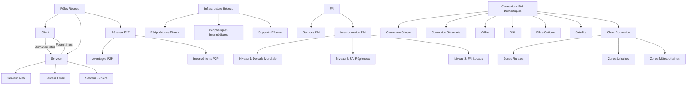

---
tags:
  - cour
  - rib
aliases:
  - Module 2
  - 01-02 | Module 2
archetype: cour
module: "RIB (Introduction au réseau)"
cssclasses:
  - max
---

# 01-02 | Module 2

> [!GOAL] Objectifs Pédagogiques
> À la fin de cette fiche, je dois être capable de :
> 1. Comprendre les rôles des [[Client|clients]] et [[Server|serveurs]] dans les [[Network|réseaux modernes]].
> 2. Identifier les différents types de [[Server|serveurs]] et [[Client|clients]], ainsi que les [[Network|services réseau]] associés.
> 3. Distinguer les caractéristiques, avantages et inconvénients des [[PeerToPeer|réseaux Peer-to-Peer]].
> 4. Décrire les composants fondamentaux de l'[[NetworkInfrastructure|infrastructure réseau]].
> 5. Expliquer le rôle des [[InternetServiceProvider|fournisseurs d'accès Internet]] et les différents types de [[Internet|connexions Internet]] domestiques.
> 6. Reconnaître les facteurs influençant le choix d'une [[Internet|connexion Internet]].

## 📝 Synthèse du Cours

### 1. Rôles dans les Réseaux Modernes et Types de Serveurs/Clients
- Dans un [[Network|réseau]], un ordinateur peut agir comme [[Client|client]], [[Server|serveur]] ou les deux simultanément.
- Le rôle est déterminé par le [[OperatingSystem|logiciel]] installé sur l'ordinateur.

>[!note]  Définition Clé
    > **[[Client|Client]]** : Un [[EndDevices|hôte]] informatique qui exécute un [[OperatingSystem|logiciel]] permettant de demander et d'afficher des informations obtenues d'un [[Server|serveur]].
    > **[[Server|Serveur]]** : Un [[EndDevices|hôte]] informatique qui exécute un [[OperatingSystem|logiciel]] permettant de fournir des informations ou des [[Network|services]] à d'autres [[EndDevices|hôtes]] du [[Network|réseau]].

- **Types de [[Server|Serveurs]] :**
    - **[[WebServer|Serveur Web]]** : Fournit des pages web aux navigateurs clients.
    - **[[EmailServer|Serveur Email]]** : Gère l'envoi et la réception de [[Email|courriels]].
    - **[[FileServer|Serveur de Fichiers]]** : Stocke et partage les fichiers centralisés.
- **Types de [[Client|Clients]] :**
    - **Navigateurs Web** (ex: Chrome, Edge) : Demandent des pages web au [[WebServer|serveur web]].
    - **Clients Email** (ex: Microsoft Outlook) : Permettent d'accéder, d'envoyer et de recevoir des [[Email|courriels]] via un [[EmailServer|serveur email]].
- **[[ClientServerArchitecture|Communication Client-Serveur]] :** Le [[Client|client]] demande des informations, le [[Server|serveur]] les fournit. Tous les [[EndDevices|ordinateurs]] connectés participant aux [[NetworkCommunication|communications]] sont des [[EndDevices|hôtes]].

### 2. Réseaux Peer-to-Peer (P2P)
- Un [[PeerToPeer|réseau P2P]] permet à un ordinateur de fonctionner comme [[Client|client]] et [[Server|serveur]] simultanément.
- C'est un modèle courant dans les [[HomeNetwork|réseaux domestiques]] et les petites [[Enterprise|entreprises]].
- **Avantages :**
    - Facile à configurer.
    - Moins complexe.
    - Coût réduit (pas de serveur dédié).
    - Idéal pour les tâches simples.
- **Inconvénients :**
    - Pas d'[[CentralizedAdministration|administration centralisée]].
    - [[SecurityVulnerabilities|Moins sécurisé]].
    - [[Scalability|Non évolutif]] pour de grands volumes de trafic.
    - [[NetworkPerformance|Performances ralenties]] si l'hôte gère les deux rôles intensivement.

### 3. Infrastructure de Réseau
- L'[[NetworkInfrastructure|infrastructure réseau]] est la plateforme physique et logique qui supporte le [[Network|réseau]], fournissant des canaux stables et fiables pour les [[NetworkCommunication|communications]].
- **Composants clés :**
    - **[[EndDevices|Périphériques Finaux]]** : Les points de départ et d'arrivée des [[Message|messages]] (ex: [[Computers|ordinateurs]], smartphones, [[NetworkPrinter|imprimantes]]). Les [[AddressingInformation|adresses]] sont utilisées pour les identifier de manière unique.
    - **[[IntermediateDevice|Périphériques Intermédiaires]]** : Les dispositifs qui connectent les [[EndDevices|hôtes]] et assurent le chemin des [[Message|messages]] (ex: [[Router|routeurs]], commutateurs, [[AccessPoint|points d'accès]]).
    - **[[NetworkMedia|Supports Réseau]]** : Les canaux physiques de [[DataTransmission|transmission des données]] (ex: [[FiberOpticCable|câbles]] en cuivre ou fibre optique, [[RadioWaves|connexions sans fil]]).

### 4. Fournisseurs d'Accès Internet (FAI) et Types de Connexions
- Un [[InternetServiceProvider|FAI]] assure la liaison entre un [[HomeNetwork|réseau domestique]] (ou d'[[Enterprise|entreprise]]) et l'[[Internet|Internet]].
- Ils proposent souvent des services supplémentaires comme des [[Email|comptes de messagerie]], [[SecureStorage|stockage réseau]], et des [[Security|services de sécurité]].
- **Interconnexion des [[InternetServiceProvider|FAI]] :**
    - Les [[InternetServiceProvider|FAI]] sont interconnectés de manière hiérarchique pour former l'[[Internet|Internet]].
    - **Niveau 1** : Le [[InternetBackbone|Réseau fédérateur mondial]], qui utilise principalement des [[FiberOpticCable|câbles en fibre optique]] (sous terre et sous la mer).
    - **Niveau 2** : [[RegionalInternetRegistry|FAI régionaux]].
    - **Niveau 3** : FAI locaux.
- **Connexions [[InternetServiceProvider|FAI]] Domestiques :**
    - **Connexion Simple** (non recommandée) : Modem direct entre ordinateur et [[InternetServiceProvider|FAI]], offrant peu de [[Security|sécurité]].
    - **Connexion Sécurisée** : Utilisation d'un [[Router|routeur]] intégré (souvent avec Wi-Fi et un commutateur) pour assurer l'[[IPAddressing|adressage IP]] et la [[Security|sécurité]] du [[HomeNetwork|réseau domestique]].
- **Types de Connexions Internet (Technologie) :**
    - **[[CableInternet|Connexion Câble]]** : Via [[CoaxialCable|câble coaxial]] (offerte par les fournisseurs de télévision par câble).
    - **[[DigitalSubscriberLine|Connexion DSL]]** : Via ligne téléphonique (la qualité dépend de la ligne et de la distance au central).
    - **[[FiberOpticCable|Fibre Optique]]** : Offre une très haute [[Bandwidth|bande passante]], prédominante dans les zones métropolitaines.
    - **[[SatelliteLinks|Connexion satellite]]** : Souvent nécessaire dans les zones rurales.
- **Choix de la Connexion :** Il dépend de l'emplacement géographique et de la disponibilité des [[InternetServiceProvider|FAI]]. Les zones métropolitaines bénéficient généralement de la [[FiberOpticCable|fibre optique]] directe, tandis que les zones urbaines ont accès au [[CableInternet|câble]] et au [[DigitalSubscriberLine|DSL]], et les zones rurales aux [[SatelliteLinks|liaisons satellitaires]].

## 🧠 Carte Mentale / Schéma

## ❓ Quiz de Révision (Active Recall)
> [!QUESTION] Question 1
> Quelle est la principale différence entre un rôle de [[Client|client]] et un rôle de [[Server|serveur]] dans un [[Network|réseau moderne]], et qu'est-ce qui détermine ce rôle ?
> > [!success]- Réponse
> > Un [[Client|client]] demande des informations ou des [[Network|services]], tandis qu'un [[Server|serveur]] les fournit. Le rôle d'un ordinateur est déterminé par le [[OperatingSystem|logiciel]] installé.

> [!QUESTION] Question 2
> Citez trois types de [[Server|serveurs]] courants et décrivez brièvement leur fonction.
> > [!success]- Réponse
> > 1. **[[WebServer|Serveur Web]]** : Fournit des pages web aux navigateurs clients.
> > 2. **[[EmailServer|Serveur Email]]** : Gère l'envoi et la réception de [[Email|courriels]].
> > 3. **[[FileServer|Serveur de Fichiers]]** : Stocke et partage des fichiers centralisés.

> [!QUESTION] Question 3
> Quels sont deux avantages et deux inconvénients majeurs d'un [[PeerToPeer|réseau Peer-to-Peer]] ?
> > [!success]- Réponse
> > **Avantages** : Facile à configurer, moins complexe, coût réduit, idéal pour les tâches simples.
> > **Inconvénients** : Pas d'[[CentralizedAdministration|administration centralisée]], [[SecurityVulnerabilities|moins sécurisé]], [[Scalability|non évolutif]], [[NetworkPerformance|performances potentiellement ralenties]] (si l'hôte joue les deux rôles intensivement).

> [!QUESTION] Question 4
> Nommez les trois catégories principales de composants de l'[[NetworkInfrastructure|infrastructure réseau]] et donnez un exemple pour chaque.
> > [!success]- Réponse
> > 4. **[[EndDevices|Périphériques Finaux]]** : Ex: [[Computers|ordinateurs]], smartphones, [[NetworkPrinter|imprimantes]].
> > 5. **[[IntermediateDevice|Périphériques Intermédiaires]]** : Ex: [[Router|routeurs]], commutateurs, [[AccessPoint|points d'accès]].
> > 6. **[[NetworkMedia|Supports Réseau]]** : Ex: [[FiberOpticCable|câbles]] (fibre optique, cuivre), [[RadioWaves|connexions sans fil]].

> [!QUESTION] Question 5
> Quel est le rôle principal d'un [[InternetServiceProvider|FAI]] et quel type de média physique est le principal support du [[InternetBackbone|réseau fédérateur Internet]] ?
> > [!success]- Réponse
> > Le rôle principal d'un [[InternetServiceProvider|FAI]] est d'assurer la liaison entre le [[HomeNetwork|réseau domestique]] (ou d'[[Enterprise|entreprise]]) et l'[[Internet|Internet]]. Le principal support physique du [[InternetBackbone|réseau fédérateur Internet]] est le [[FiberOpticCable|câble en fibre optique]].

## 🔗 Liens du Module
* **Précédent** : [[RIB01-01_Module1]]
* **Suivant** : [[RIB01-03_Module3]]