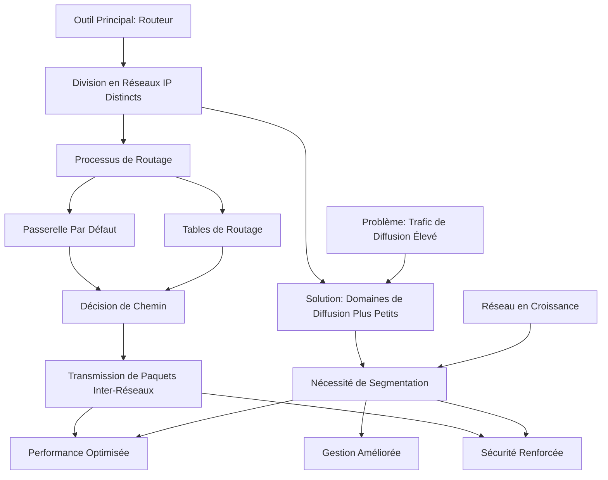

---
tags:
  - cour
  - rib
aliases:
  - Module 11
  - 01-11 | Module 11
archetype: cour
module: "RIB (Introduction au réseau)"
cssclasses:
  - max
---

# 01-11 | Module 11

> [!GOAL] Objectifs Pédagogiques
> À la fin de cette fiche, je dois être capable de :
> 1. Comprendre la nécessité et les avantages de la [[NetworkSegmentation|segmentation réseau]] pour optimiser les performances, la sécurité et la gestion.
> 2. Identifier le rôle du [[Router|routeur]] en tant qu'outil principal de [[NetworkSegmentation|segmentation]] et de [[Routing|routage]] au niveau de la couche 3.
> 3. Décrire le processus de [[Routing|routage]] détaillé, l'importance des [[RoutingTable|tables de routage]] et la fonction de la [[Gateway|passerelle par défaut]].

## 📝 Synthèse du Cours

### 1. Introduction à la [[NetworkSegmentation|Segmentation des Réseaux]]

Lorsque les [[Network|réseaux]] s'étendent, il devient crucial de les diviser en segments plus petits. Cette [[NetworkSegmentation|segmentation]] répond à des besoins essentiels pour l'infrastructure [[Network|réseau]] moderne :
*   **Optimisation des performances** : En réduisant le volume de [[Broadcast|trafic de diffusion]].
*   **Renforcement de la [[NetworkSecurity|sécurité]]** : En isolant les différentes parties du [[Network|réseau]].
*   **Facilitation de la gestion administrative** : En créant des zones logiques distinctes.

#### Quatre Raisons Majeures de Segmenter :
*   **Limitation du [[Broadcast|Trafic de Diffusion]]** : Réduit le nombre de messages inutiles que chaque appareil doit traiter et rejeter, économisant des ressources CPU et de la [[Bandwidth|bande passante]].
*   **[[BroadcastDomain|Domaines de Diffusion Plus Petits]]** : Crée des zones de [[Broadcast|diffusion]] restreintes, garantissant que seuls les appareils pertinents reçoivent les messages.
*   **[[NetworkSecurity|Sécurité Renforcée]]** : Empêche l'accès non autorisé entre les départements et protège les [[SensitiveData|ressources sensibles]], comme les serveurs de comptabilité ou les données financières.
*   **Séparation Géographique** : Permet de connecter et d'isoler des équipements situés dans différents bâtiments ou étages.

> [!NOTE] Définition Clé
> **[[BroadcastDomain|Domaine de Diffusion]]** : Désigne la zone du [[Network|réseau]] dans laquelle un message de [[Broadcast|diffusion]] peut être entendu. Dans un [[FlatNetwork|réseau non segmenté]] (utilisant uniquement des [[NetworkDevice|commutateurs]]), le [[BroadcastDomain|domaine de diffusion]] englobe l'ensemble du [[Network|réseau]].

### 2. Le [[Router|Routeur]] : Outil Principal de [[NetworkSegmentation|Segmentation]]

Le [[Router|routeur]] est l'équipement clé pour diviser un [[Network|réseau]] en segments plus petits. Il agit comme une frontière entre différents [[InternetProtocol|réseaux IP]] et est indispensable pour contrôler le flux de [[Data|données]].

#### Architecture de [[NetworkSegmentation|Segmentation]] avec des [[Router|Routeurs]] :
*   Lorsqu'un [[Router|routeur]] est inséré dans l'architecture [[Network|réseau]], chaque interface du [[Router|routeur]] définit un [[Network|réseau]] séparé. Un [[Router|routeur]] avec trois interfaces crée ainsi trois [[Network|réseaux]] distincts.
*   **Chaque segment possède son propre [[BroadcastDomain|domaine de diffusion]]**.
*   **Chaque [[Network|réseau]] dispose d'une [[IPAddressing|plage d'adresses IP]] distincte**.
*   **Le [[DataTransmission|trafic]] entre segments doit obligatoirement passer par le [[Router|routeur]]**.

### 3. Le [[Routing|Routage]] : Acheminer les [[Packet|Paquets IP]]

Le [[Routing|routage]] est le processus de détermination du meilleur chemin pour acheminer un [[Packet|paquet IP]] vers sa destination finale. Les [[Router|routeurs]] opèrent au niveau de la couche 3 (la [[InternetLayer|couche Internet]] du modèle TCP/IP), en utilisant les [[InternetProtocol|adresses IP]], contrairement aux [[NetworkDevice|commutateurs]] qui fonctionnent au niveau de la couche 2 (en utilisant les [[MediaAccessControlAddress|adresses MAC]]).

#### Processus de [[Routing|Routage]] Détaillé :
1.  **Réception du [[Packet|Paquet]]** : Le [[Router|routeur]] reçoit une [[DataFrames|trame Ethernet]] contenant un [[Packet|paquet IP]] destiné à un [[RemoteNetwork|réseau distant]].
2.  **Désencapsulation** : Le [[Router|routeur]] retire l'[[Header|en-tête Ethernet]] et extrait le [[Packet|paquet IP]] pour examiner son [[DestinationInternetProtocolVersion4Address|adresse IP de destination]].
3.  **Consultation de la [[RoutingTable|Table]]** : Il consulte sa [[RoutingTable|table de routage]] pour déterminer quelle interface mène au [[Network|réseau]] de destination.
4.  **Réencapsulation** : Le [[Router|routeur]] encapsule le [[Packet|paquet]] dans une nouvelle [[DataFrames|trame Ethernet]] avec de nouvelles [[DestinationMacAddress|adresses MAC]] (celles de l'interface de sortie du [[Router|routeur]] et de l'appareil suivant sur le chemin).
5.  **[[DataTransmission|Transmission]]** : La nouvelle [[DataFrames|trame]] est transmise via l'interface appropriée vers le [[Network|réseau]] de destination.

#### Les [[RoutingTable|Tables de Routage]] : Le GPS du Réseau
Les [[RoutingTable|tables de routage]] sont des bases de données essentielles qui permettent aux [[Router|routeurs]] de diriger le [[DataTransmission|trafic]]. Elles stockent les adresses des [[Network|réseaux]] entiers et les meilleurs chemins pour les atteindre, et non les adresses individuelles des hôtes.
*   **Méthodes de Remplissage** :
    *   **[[Routing|Dynamique]]** : Mise à jour automatique des [[RoutingTable|tables de routage]] via des [[NetworkProtocol|protocoles de routage]] (ex: OSPF, EIGRP).
    *   **[[StaticIPAddressing|Statique]]** : Configuration manuelle des entrées par l'administrateur [[Network|réseau]].
*   Si un [[Router|routeur]] ne trouve pas de correspondance pour une destination dans sa [[RoutingTable|table de routage]], il supprime le [[Packet|paquet]]. Pour éviter cela, une [[Gateway|route par défaut]] est configurée.

#### La [[Gateway|Passerelle Par Défaut]]
La [[Gateway|passerelle par défaut]] est l'[[InternetProtocol|adresse IP]] du [[Router|routeur]] local qu'un hôte utilise pour envoyer des [[Packet|paquets]] vers des [[RemoteNetwork|réseaux distants]]. Elle doit être configurée dans les paramètres [[NetworkConfiguration|TCP/IP]] de chaque appareil du [[Network|réseau]].
*   **Communication Locale** : Pour envoyer un message à un hôte sur le même [[Network|réseau]], l'appareil utilise le [[AddressResolutionProtocol|protocole ARP]] pour obtenir l'[[MediaAccessControlAddress|adresse MAC]] de destination et transmet directement la [[DataFrames|trame]].
*   **Communication Distante** : Pour atteindre un [[RemoteNetwork|réseau distant]], l'hôte encapsule le [[Packet|paquet]] avec l'[[MediaAccessControlAddress|adresse MAC]] du [[Router|routeur]] (sa [[Gateway|passerelle par défaut]]) plutôt que celle de la destination finale.
*   **Rôle du [[Router|Routeur]]** : Le [[Router|routeur]] reçoit la [[DataFrames|trame]], extrait le [[Packet|paquet IP]], détermine le chemin approprié via sa [[RoutingTable|table de routage]] et le réencapsule pour la [[DataTransmission|transmission]] vers le [[Network|réseau]] de destination.

### 4. Avantages et Inconvénients des Architectures Réseau

#### [[FlatNetwork|Segment Unique]] (Réseau Plat) : Avantages et Inconvénients
*   **Avantages** :
    *   Convient aux [[Network|réseaux]] simples et de petite taille.
    *   [[Complexity|Complexité]] réduite, moins d'équipements et de coûts.
    *   Découverte automatique des appareils facilitée.
    *   [[DataTransmission|Transfert de données]] plus rapide grâce à la communication directe.
    *   Accès simplifié aux [[Resource|ressources]] partagées.
*   **Inconvénients** :
    *   Tous les hôtes partagent un seul [[BroadcastDomain|domaine de diffusion]].
    *   [[Performance|Ralentissement des performances]] avec l'augmentation du nombre d'hôtes.
    *   Difficile de mettre en œuvre la [[QualityOfService|qualité de service (QoS)]].
    *   [[NetworkSecurity|Implémentation de la sécurité]] plus complexe.
    *   Pas de séparation fonctionnelle ou organisationnelle.

#### [[NetworkSegmentation|Segmentation Multiple]] : Une Architecture Évolutive
*   **Avantages de la [[NetworkSegmentation|Segmentation]]** :
    *   **[[Scalability|Adaptation à la Croissance]]** : Parfaitement adapté aux [[Network|réseaux]] vastes et complexes nécessitant une organisation structurée.
    *   **[[Performance|Performance Optimisée]]** : Division des [[BroadcastDomain|domaines de diffusion]] réduisant le [[DataTransmission|trafic]] sur chaque segment.
    *   **[[NetworkSecurity|Sécurité Renforcée]]** : [[Isolation|Isolation]] des équipements entre segments empêchant la découverte non autorisée et les mouvements latéraux.
    *   **Organisation Améliorée** : Structure logique reflétant l'organisation fonctionnelle de l'entreprise.
*   **Compromis à Considérer** :
    *   La [[NetworkSegmentation|segmentation]] nécessite du [[Routing|routage]] (couche de distribution), ce qui peut introduire une [[Latency|latence]] sur le [[DataTransmission|trafic]] inter-segments.
    *   L'infrastructure devient plus complexe et coûteuse, nécessitant l'acquisition et la configuration de [[Router|routeurs]] supplémentaires.

### Points Clés à Retenir
*   La [[NetworkSegmentation|croissance des réseaux]] impose une division en segments pour optimiser les performances, la [[NetworkSecurity|sécurité]] et la gestion.
*   Les [[Router|routeurs]] sont essentiels pour la [[NetworkSegmentation|segmentation]], ils fonctionnent au niveau de la couche 3 et créent des frontières entre [[InternetProtocol|réseaux IP]] distincts.
*   Les [[RoutingTable|tables de routage]] contiennent les chemins vers les [[Network|réseaux]] de destination, et non les adresses individuelles des hôtes.
*   La [[Gateway|passerelle par défaut]] est une configuration obligatoire sur chaque hôte pour communiquer avec les [[RemoteNetwork|réseaux distants]].

## 🧠 Carte Mentale / Schéma

## ❓ Quiz de Révision (Active Recall)
> [!QUESTION] Question 1
> Quelles sont les quatre raisons majeures qui justifient la [[NetworkSegmentation|segmentation d'un réseau]] ?
> > [!success]- Réponse
> > Les quatre raisons majeures sont :
> > 1.  Limitation du [[Broadcast|trafic de diffusion]].
> > 2.  Création de [[BroadcastDomain|domaines de diffusion plus petits]].
> > 3.  Renforcement de la [[NetworkSecurity|sécurité]].
> > 4.  Séparation géographique des équipements.

> [!QUESTION] Question 2
> Quel est le rôle principal d'un [[Router|routeur]] en matière de [[NetworkSegmentation|segmentation réseau]], et à quelle couche du modèle OSI/TCP-IP opère-t-il ?
> > [!success]- Réponse
> > Le [[Router|routeur]] est l'outil principal de [[NetworkSegmentation|segmentation réseau]]. Il divise un [[Network|réseau]] en segments plus petits, agissant comme une frontière entre différents [[InternetProtocol|réseaux IP]] et contrôlant le flux de [[Data|données]] entre eux. Il opère à la couche 3 ([[InternetLayer|couche Internet]]) du modèle TCP/IP, utilisant les [[InternetProtocol|adresses IP]].

> [!QUESTION] Question 3
> Décrivez succinctement les cinq étapes clés du processus de [[Routing|routage]] d'un [[Packet|paquet IP]] par un [[Router|routeur]].
> > [!success]- Réponse
> > Les cinq étapes sont :
> > 1.  **Réception du [[Packet|Paquet]]** : Le [[Router|routeur]] reçoit une [[DataFrames|trame Ethernet]].
> > 2.  **Désencapsulation** : Il retire l'[[Header|en-tête Ethernet]] et extrait le [[Packet|paquet IP]].
> > 3.  **Consultation de la [[RoutingTable|Table]]** : Il examine l'[[DestinationInternetProtocolVersion4Address|adresse IP de destination]] et consulte sa [[RoutingTable|table de routage]].
> > 4.  **Réencapsulation** : Il encapsule le [[Packet|paquet]] dans une nouvelle [[DataFrames|trame Ethernet]] avec de nouvelles [[DestinationMacAddress|adresses MAC]].
> > 5.  **[[DataTransmission|Transmission]]** : La nouvelle [[DataFrames|trame]] est transmise via l'interface appropriée.

> [!QUESTION] Question 4
> Expliquez la différence entre un [[FlatNetwork|réseau plat]] (segment unique) et une [[NetworkSegmentation|architecture segmentée]] en termes de [[BroadcastDomain|domaines de diffusion]] et de [[NetworkSecurity|sécurité]].
> > [!success]- Réponse
> > Dans un [[FlatNetwork|réseau plat]], tous les hôtes partagent un seul [[BroadcastDomain|domaine de diffusion]], ce qui signifie que le [[Broadcast|trafic de diffusion]] est reçu par tous les appareils. En termes de [[NetworkSecurity|sécurité]], il n'y a pas d'[[Isolation|isolation]] entre les appareils, rendant le [[Network|réseau]] plus vulnérable aux attaques de mouvement latéral.
> >
> > Dans une [[NetworkSegmentation|architecture segmentée]], des [[Router|routeurs]] sont utilisés pour créer plusieurs [[BroadcastDomain|domaines de diffusion]] distincts. Cela réduit le [[Broadcast|trafic de diffusion]] dans chaque segment et, plus important encore, renforce la [[NetworkSecurity|sécurité]] en isolant logiquement les différents segments, empêchant l'accès non autorisé et protégeant les [[SensitiveData|ressources sensibles]].

## 🔗 Liens du Module
*   **Précédent** : [[RIB01-10_Module10|01-10 | Module 10]]
*   **Suivant** : [[RIB01-12_Module12|01-12 | Module 12]]